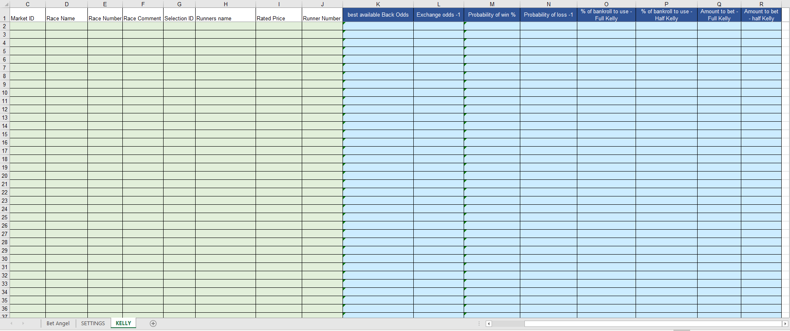
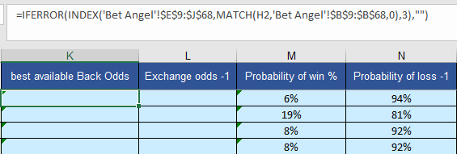
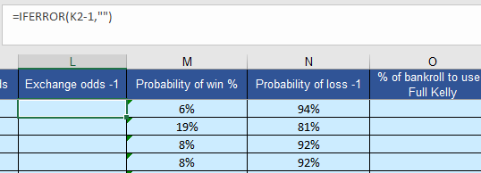
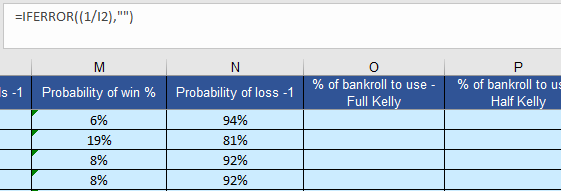
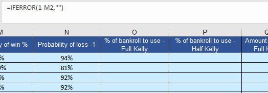
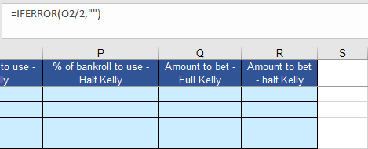
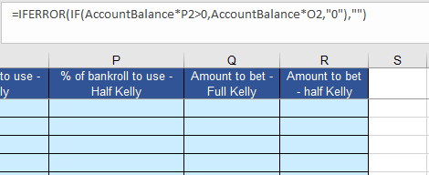
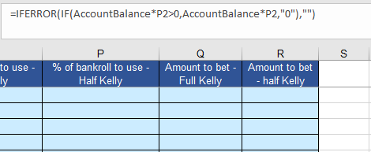

# Bet Angel Pro: Kelly Criterion staking

---
## Automating with Kelly staking method and Bet Angel Pro

In other tutorials on the Betfair Automation Hub, we've gone through how to automate betting strategies based on ratings, market favourites and tips. For this tutorial, we're going to implement a staking strategy which can be used in conjunction with most other betting strategies. Determining how much you stake on a wager is a crucial consideration for successful punters. The Kelly Criterion is a staking method well known across wagering and investment professionals which should be known and considered by all Betfair punters.

Bet Angel Pro has a spreadsheet functionality that lets you place bets using your own variables and information from the live market, which is what we've used here to not only automate thoroughbred ratings from the Hub, but to also add the Kelly staking method. There are so many different ways to use this part of Bet Angel and we're very open to any thoughts about more effective ways of implementing this sort of strategy. You're welcome to reach out to us on automation@betfair.com.au with your feedback and opinions. 

--- 
### - The plan

We'll be building on the Bet Angel Ratings tutorial which utilizes the the [Betfair's Data Scientists' thoroughbred ratings model](https://www.betfair.com.au/hub/racing/horse-racing/predictions-model/). For this tutorial, we'll be assuming that you have already gone through the ratings tutorial, but if you havn't, you can [check it out here](../betAngelRatingsAutomation/), as the concepts and underlying trigger based strategy here do build on what we covered previously. 

Staking strategies such as Kelly Criterion can be adventagous for automation when used in conjunction with a successful selection strategy. Rather than sending your bot to place static stake values for every bet, methods such as this let you place bet stakes which take into consideration your ratings and betting bank. 

If you're not familiar with the Kelly Criterion staking strategy, we recommend having a quick read  about [Kelly staking](https://en.wikipedia.org/wiki/Kelly_criterion). There are plenty more resources on the internet relating to the strategy which may provide a more in depth understanding. 

!!! info "Resources"
    - Ratings: [Betfair's Data Scientists' thoroughbred ratings model](https://www.betfair.com.au/hub/racing/horse-racing/predictions-model/)
    - Before you start: [check out the Bet Angel Ratings tutorial](../betAngelRatingsAutomation/) 
    - Rules: [here's the spreadsheet](./assets/BetAngel_Kelly.xls) we set up with our macros and rules included, but you'll obviously need to tweak it to suit your strategy
    - Understanding how the [Kelly Criterion staking strategy works](https://en.wikipedia.org/wiki/Kelly_criterion)
    - Tool: [Bet Angel Pro](https://www.betangel.com/bet-angel-professional/)

---

### - Recapping the strategy covered in the Bet Angel ratings automation tutorial

We'll be using the same trigger strategy that's outlined in the [Bet Angel Ratings tutorial](../betAngelRatingsAutomation/) which uses the [thoroughbred ratings shared by our Data Scientists on the Hub](https://www.betfair.com.au/hub/racing/horse-racing/predictions-model/). The trigger has been simplified in this tutorial and we'll need to make small tweaks to the stake column of the 'BET ANGEL' worksheet (column N). We've also added an additional option to the 'SETTINGS' worksheet which will allow you to choose either a half Kelly or full Kelly stake. If you havn't yet read our Bet Angel ratings tutorial, we highly recommend that you do so as to understand how the concept of the bet placement trigger works. The tutorial can be found [here](../betAngelRatingsAutomation/).

---
### - Set up 

Make sure you've downloaded and installed Bet Angel Pro, and signed in.
Once you open the program up click on the 'G' Guardian icon and open the Guardian functionality up. 


---
### - Writing your rules

We're using a [customised version of the Bet Angel Ratings tutorial template](./assets/BetAngel_Kelly.xls) to implement our staking strategy, so it can not only make betting decisions based on our ratings, but also calculate the stakes based on the Kelly Criterion staking strategy. Excel is an excellent tool, but it can take an investment of time to be able to use it effectively. 

This is how we used Excel to implement our set of rules. 


### - Using cell references to simplify formulas

Throughout this tutorial, we'll be referencing certain cells with custom names that will make it easier to understand and follow the formulas as we progress. This is an especially effective method to
keep on top of more complex strategies that require long formaulas to implement.
 
!!! info "Cell names used in this tutorial"

     - **Account Balance** refers to cell C6 of the 'BET ANGEL' worksheet
     - **StakeType** refers to cell I5 of the "SETTINGS' worksheet where you can change between half Kelly or Full Kelly stake
     - **Full_Kelly** refers to the entire Q Column of the 'KELLY' worksheet
     - **HALF_Kelly** refers to the entire R Column of the 'KELLY' worksheet


**Calculating the Kelly stake**

As explained [here](https://en.wikipedia.org/wiki/Kelly_criterion), the formula to claculate the Kelly stake is:

```(BP-Q)/B```
Where B is the odds you are getting -1 (because we're using decimal odds), P is the likelihood of the bet winning and Q is the probability of losing (or 1 – P).

To show the steps of the calculation and to ensure that it's doing what we're expecting it to, we've created a 8 column table in the 'KELLY' worksheet.  



### Stepping through each step:

- **Column K - best available Back odds** Check the runner's name in our ratings and match it with the runners listed in the market ('BET ANGEL' worksheet) and return the best available back odds from the G column

```
=IFERROR(INDEX('Bet Angel'!$E$9:$J$68,MATCH(H2,'Bet Angel'!$B$9:$B$68,0),3),"")
```



- **Column L - Exchange odds -1** Take the value returned in column K and minus 1 (because we're using decimal odds)

```
=IFERROR(K2-1,"")
```



- **Column M - Probability of win %** 1 divided by the rated price from column I which converts the decimal odds to a percentage probability

```
=IFERROR((1/I2),"")
```



- **Column N - Probability of loss %** 1 divided by the probability of a win from column M

```
=IFERROR(1-M2,"")
```



- **Column O - % of bankroll to use - Full Kelly** Take the best available back odds (minus 1) from the L column, times it by the probability to win in the M column, then minus the probability to lose from the N column. Finally, divide that by the best available back odds (minus 1)

```
=IFERROR(((L2*M2)-N2)/L2,"")
```


- **Column P - % of bankroll to use - Half Kelly** Take the calculation from column O and simply divide it by 2

```
=IFERROR(O2/2,"")
```



- **Column Q - Amount to bet - Full Kelly** If the account balance times the percentage of the bankroll to use for half kelly stake is greater than 0, retrieve the account balance which Bet Angel populates in cell C6 of the 'BET ANGEL' worksheet and times it by the percentage of the bankroll (Column O) to use for the Full Kelly. If it's not greater than 0, then simply print 0.

```
=IFERROR(IF(AccountBalance*P2>0,AccountBalance*O2,"0"),"")
```



- **Column R - Amount to bet - half Kelly** If the account balance times the percentage of the bankroll to use for half Kelly stake is greater than 0, then calculate the account balance times the percentage of the bankroll. If it's not greater than 0, then simply print 0. 

```
=IFERROR(IF(AccountBalance*P2>0,AccountBalance*P2,"0"),"")
```


- **Result:** Once the calculations are complete, we're left with two stake values that we will be able to use with our trigger. Column Q for a full Kelly stake and column R for a half Kelly stake. In the below image examples, we have a market for Geelong with the half and full Kelly.


!!! info "Excel functions"

    - [IF statement:](https://support.office.com/en-us/article/if-function-69aed7c9-4e8a-4755-a9bc-aa8bbff73be2) IF(if this is true, do this, else do this)
    - [IFERROR:](https://support.office.com/en-us/article/iferror-function-c526fd07-caeb-47b8-8bb6-63f3e417f611) If there is an error that occurs in the cell, display nothing
    - [AND statement:](https://support.office.com/en-us/article/and-function-5f19b2e8-e1df-4408-897a-ce285a19e9d9) AND(this is true, and so is this, and so is this) - returns true or false
    - [Absolute references:](https://support.office.com/en-us/article/switch-between-relative-absolute-and-mixed-references-dfec08cd-ae65-4f56-839e-5f0d8d0baca9) if you're copy/pasting formulas it's important that you make links absolute when you don't want the cell being referenced to change relative to the new cell the formula is being pasted into. You do this by putting a $ in front of the parts of the reference you don't want to 'move'. 

---
### - Preparing the spreadsheet

You need to copy/paste these eight formulas into the relevant column cells which is highlighted as blue - We copied ours into 1500 rows in the sheet, just in case you have a large number of ratings. Excel is clever enough to automatically update the relative links in the formulas, so you should be able to copy/paste the same formula into each cell as long as you've got your [relative and absolute references straight](https://support.office.com/en-us/article/switch-between-relative-absolute-and-mixed-references-dfec08cd-ae65-4f56-839e-5f0d8d0baca9). 


- **Stake:** Here we're telling excel to take a look into B column, if a runner name is present, then match that name to either the value which has been calculated for the full or half Kelly, depending on what has been selected by the drop down box in the 'SETTINGS' worksheet.

```=IF(B9="","",INDEX(KELLY!Q:R,MATCH(B9,RunnerName,0),StakeType))```


---
## And you're set!

Once you've set your Kelly strategy set up with your strategy, it should only take a number of seconds to load your markets for the day. Just make sure you have all of the Bet Angel settings correctly selected before you leave your to run, as some of them reset by default when you turn Bet Angel off.

---
## Areas for improvement

There are parts of this approach that we're still trying to get to work to our liking, and we'll update this article as we find better solutions. If you have any suggestions for improvements please reach out to automation@betfair.com.au - we'd love to hear your thoughts. 

For example, the spreadsheet only binds with one market at a time, so if one market gets delayed and runs overtime the program won't be able to move on to the next market - We missed some races because of this. 

---
## What next? 

We're working through some of the popular automation tools and creating articles like this one to help you learn how to use them to implement different styles of strategies. If you have any thoughts or feedback on this article or other programs you'd like to see us explore please reach out to automation@betfair.com.au - this article has already been updated with extra learnings including variable percentages and new macros.

---
## Disclaimer

Note that whilst automated strategies are fun and rewarding to create, we can't promise that your betting strategy will be profitable, and we make no representations in relation to the information on this page. If you're implementing your own strategies, you do so entirely at your own risk and you are responsible for any winnings/losses incurred. Under no circumstances will Betfair be liable for any loss or damage you suffer.