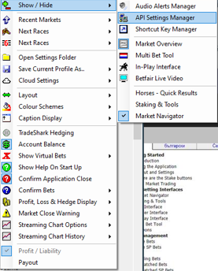
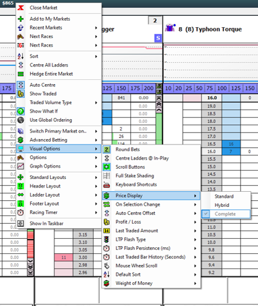
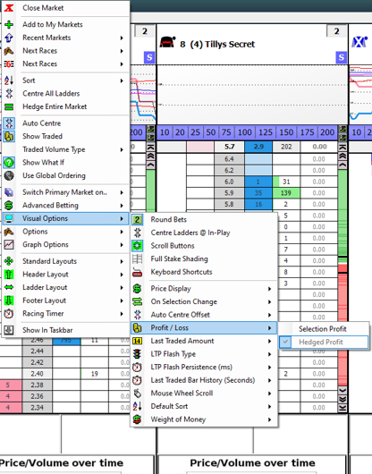

# Geeks Toy: Optimising Refresh settings
---
## **Refresh settings**

Geeks Toy can refresh up to 4 times faster than the exchange! You do also can change some settings to make the full market depth refresh constantly or just have selections closest to the match point refresh constantly, while the rest of the market displays at a slower rate.

When you load Geeks Toy:

- Right click and go to “Show/Hide”
- Then click on “API Settings Manager”

You then have six different options, allowing you to change various refresh rates inside the software. (It is worth noting that the exchange updates every 1000ms, So setting refresh rates to 250ms makes them refresh 4 times faster than the standard exchange)

- **Bets** - the information relating to your bets for a market, both matched and unmatched
- **Prices** - the information relating to the amounts waiting to back and lay. This varies depending on the setting used on the Ladder for Price Display. If Standard or Hybrid is selected it refers to the front three back and lay prices. If Complete is selected it refers to all of the prices, this requires a lot more information to be downloaded each call which is not suitable for slower internet connections and those on limited download allowances
- **Complete Prices in Hybrid mode** - the amounts waiting to back and lay outside of the front three prices, i.e. full market depth, when Hybrid Price Display is selected on the Ladder. For people with slow internet connections and those on limited download allowances it should not be set low i.e. less than 1000ms
- **Traded Volume** - the information relating to traded volumes
- **External Bets** - How often to poll for bets made external to the application. The default is 10 seconds. This saves on bandwith & weighted calls if you only use this application for betting.
- **Account Funds** - the information relating to your balance. If a change is made to a bet, i.e. a bet is submitted, altered or matched the balance will be updated automatically

You can change visibility of these settings within the ladder format.

Once you are in a market ladder do the following:

- Right click the market header
- Select “Visual Options”
- Select “Price Display”

You will see 3 options:

Standard is where you will only see the first 3 sets of odds and they will be updated as per your API settings. The rest of the market will not be visible.

Hybrid is where the entire market is visible but only the first 3 prices will be updated as per your API settings.

Complete is where the entire market is updated as per the API settings.

**Selection Profit or Hedged (Market) Profit**

As Geeks Toy is predominantly used for trading markets, a great setting to use is the for the software to show you your Profit/Loss on a certain selection within the market, or you overall Profit/Loss on the entire market (also known as your hedged profit).

Once you are in a market ladder do the following:

- Right click the market header
- Select “Visual Options”
- Select “Profit/Loss”

You will see two options

Selection Profit is the option you will can select if you would like to see Profit/Loss on each selection in the market individually.

Hedged Profit is the option you can select for the software to show you your overall profit/loss across the entire market cumulatively.

----

## Resources

Geeks Toy Youtube:

<https://www.youtube.com/user/GeeksToy>

Caan Berry Pro Trader

<https://www.youtube.com/user/caanberry>

Betfair Interview with Cann Berry

<https://www.betfair.com.au/hub/10-questions-with-caan-berry-pro-betfair-trader/>

Betfair Geeks Toy overview

https://www.betfair.com.au/hub/geeks-toy-betting-app/

