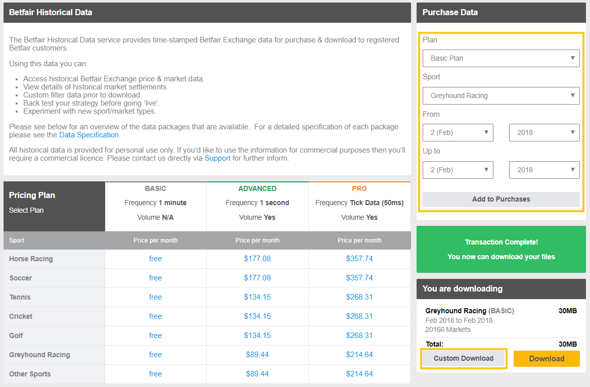
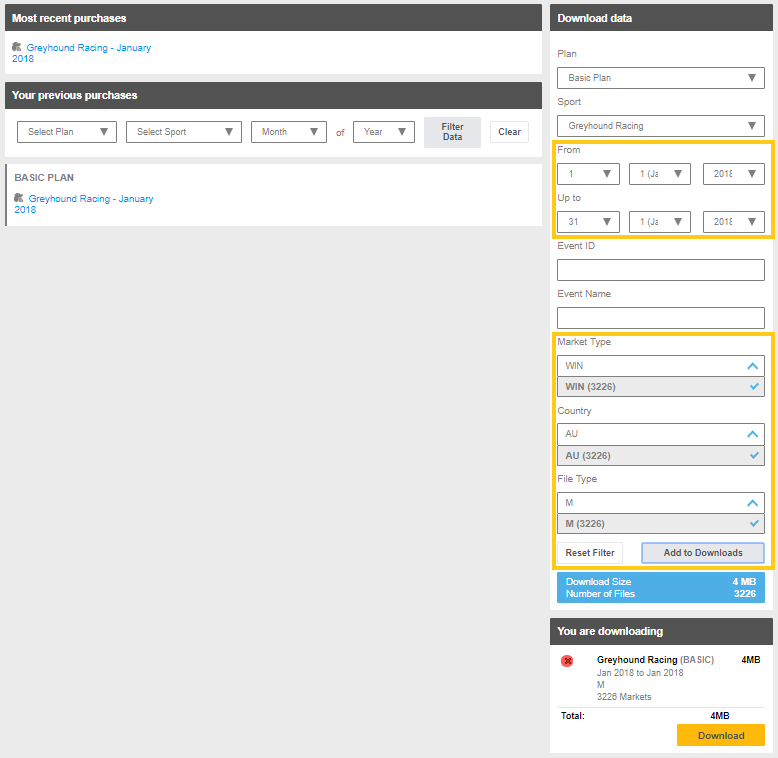
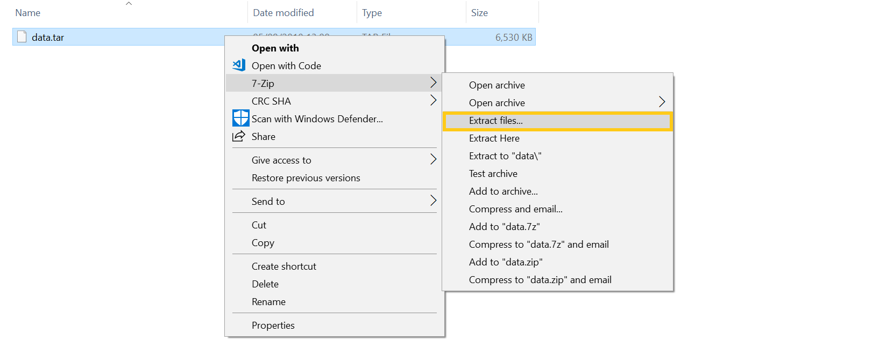
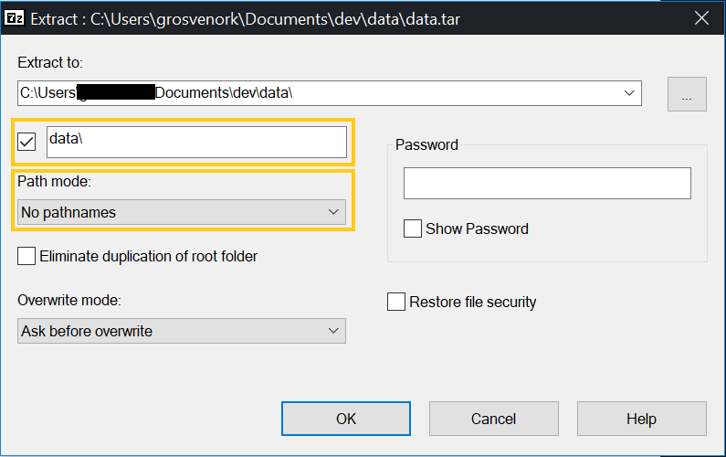
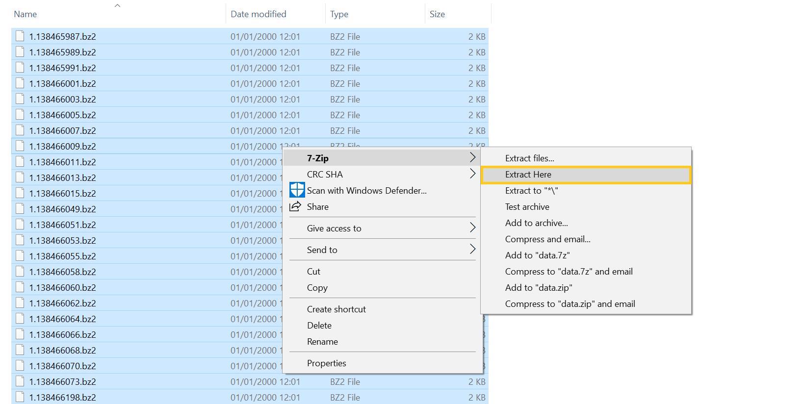

# Using the Historic Data site

---
The [Betfair Historic Data site](https://historicdata.betfair.com/#/home) includes complete historic data for nearly all markets offered on the Exchange since 2016, when the new APING was launched. The data available includes prices, volume traded, winning status, average weighted price, BSP, and a variety of other details that are valuable for modelling and strategy development. 

We know that the process of downloading and extracting these data files can be a bit intimidating the first time round, so here's a walk through of one way to go about it to help make it more accessible. 

!!! note "Data tiers"
    There are three tiers of historic data available on this site. You can download samples of each tier of data [here](https://historicdata.betfair.com/#/help).

    The biggest differece is between the free and paid data. The free data includes a lot of information about the market, but no volume, and only last traded price per minute, not a full price ladder. The two paid tiers include the same data, just at different frequencies. If your strategy isn't particularly price sensitive and doesn't need volume as a variable then you'll probably be fine wtih the free tier, however if you need to see a more granular view of the market then you should probably consider the paid advanced or pro tiers. 

    A full catalogue of the values included in each data tier is available [here](https://historicdata.betfair.com/Betfair-Historical-Data-Feed-Specification.pdf).
    
|**Basic**    |**Advanced**    |**Pro**      |     
|:------------|:---------------|:------------|
|<li>1 minute intervals</li><li>last traded price</li><li>no volume</li> | <li>1 second intervals</li><li>price ladder (top 3)</li><li>volume</li> | <li>API tick intervals (50ms)</li><li>price ladder (full)</li><li>volume</li> |
 

---
### Purchasing the data

Start by going to [the Betfair Historic Data site](https://historicdata.betfair.com/#/home) and log in using your Betfair account. Note: if you have less than 100 Betfair points you may have problems downloading data. 

On the [Home](https://historicdata.betfair.com/#/home) page select the data set you want to download.

!!! note "Free data"

    - You need to 'purchase' the data set you want to download, even if it's from the free tier
    - You can only 'purchase' each time period of data once. For example, if you had previously 'purchased' all Greyhound data for January 2018, then tried to download Greyhound data for January to March 2018 you would receive an error, and would need to purchase the data for February to March instead. 

Once you 'purchase' your choice of data it's recommended that you go to the [My Data](https://historicdata.betfair.com/#/mydata) page, and choose the subset of data to then download.

---
### Downloading the data

On the [My Data](https://historicdata.betfair.com/#/mydata) page you can filter the purchased data to the actual markets you're interested in. You can filter by Sport, Date range, EventId, Event Name, Market Type, Country & File Type (M = market, E = Event), which will cut down the size of the data you need to download.

For example, if you wanted the win market for Australian and New Zealand greyhound races you'd use these filters. 

!!! note "File type"
    The file type filter has two options that you can choose from:

    - **E = Event** - includes event level data, i.e. Geelong greyhounds on x date
    - **M = Market** - includes market level data, i.e. the win market for Geelong greyhounds race 3 on x date

The site can be pretty slow to download from, and you'll generally have a better experience if you download the data a bit at a time, say month by month. Alternatively if you're going to download a lot of data it might be worth having a look at the historic data API, that can automate the download process and speed it up significantly. There's a guide available [here](https://historicdata.betfair.com/#/apidocs), and some [sample code](https://github.com/betfair/historicdata) the help get you started.

---
### Unzipping the files

You'll need to download a program to unzip the TAR files. Here we'll be using [7Zip](https://www.7-zip.org/), which is free, open source and generally well respected. Once you've downloaded it make sure you also install it onto the computer you'll be using to open the data files.

Locate the data.tar file in your computer's file explorer program. Right click on the file, select '7-Zip' from the menu then choose 'Extract files...'.

In the model that pops up change the path mode to 'No pathnames'. You can also change the name and/or path of the folder you want the files extracted to if you want to.

You now have a collection of .bz2 files. The final step is to select all the files, right click, select '7-Zip' from the menu then choose 'Extract here'. This will then extract all the individual zipped files which you can then either open in a text editor - you can use something basic like Notepad (installed on basically all computers by default) or a more complete program like [Visual Studio Code](https://code.visualstudio.com/) (my go to), [Vim](https://www.vim.org/) or [Notepad++](https://notepad-plus-plus.org/) - or you can parse over the using a program to do the work for you. We'll explore how to parse the data another time. If you're opening the files with a text editor you might need to right click, choose 'open with' and select your preferred program. 

---
### What's it for? 

The data available on the Historic Data site is extensive, and can be a really valuable tool or input. For example, you can include some of the columns as variables in a predictive model, compare BSP odds against win rates, or determine the average length of time it takes for 2 year old horses to run 1200m at Geelong. Quality data underpins the vast majority of successful betting strategies, so becoming comfortable working with the data available to you is a really important part of both the modelling and automation processes. 

---
### Extra resources

Here are some other useful resources that can help you work with this Historic Data:

- [Historic Data FAQs](https://historicdata.betfair.com/#/help)
- [Data Specification](https://historicdata.betfair.com/Betfair-Historical-Data-Feed-Specification.pdf)
- [API for downloading historic data files](https://historicdata.betfair.com/#/apidocs) (quicker than manually downloading)
- [Sample code for using the historic data download API](https://github.com/betfair/historicdata)
 
  