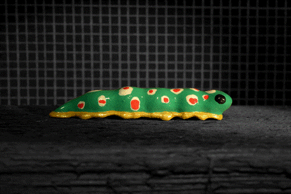
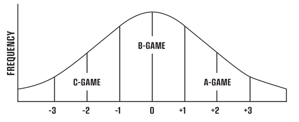

# 7: Maximize Your Learning with the Inchworm Concept

The importance of maximizing your learning should be obvious. The punter who learns faster has an advantage, much like an athlete who separates themselves by developing skills faster than their competitors.

But do you ever step back to ask yourself: Is the way I’m working the best way for me to improve? If you’re like many of the clients that I’ve worked with across multiple industries, punters included, the answer is no.

That doesn’t mean you’re not committed to developing your expertise and improving your analysis, modeling, risk management, or ability to identify new strategies. It is obvious you do those things, and more, by the sheer fact that you’re reading this article. But I suspect that many of you have fallen into a common trap, where you take your overall process for granted and miss the chance to be more effective. The good news is that you can do that quite easily – it just takes thinking about learning from a new perspective.

The easiest way for you to maximize your learning is not by focusing on your strengths, it’s by improving your weaknesses. By this I mean the weaknesses that you cannot outsource to someone else or a computer, like your ability to handle the emotional ups/downs. Weaknesses are often well-known since they’re so costly, and yet, they’re equally detested. It’s much more fun and exciting to build on existing strengths than it is to dig around in crap. But doing that dirty work accelerates your progress, while avoiding it paralyzes your progress.

To drive home this dynamic, there’s an insect that perfectly represents what I’m talking about. You heard me right, an insect. It’s called an inchworm, and it is a wonderful illustration of how to maximize your learning. It also happens to be one the most commonly cited concepts from my books that readers say had a big impact on them.

## The Inchworm Concept

As you can see below, an inchworm moves in a distinct way. If you look closely enough, it looks like a moving bell curve.

  

As it relates to your performance, a bell curve can show the natural variation that exists in your decision-making. Think about the quality of your punting decisions over the last 6 to 12 months. Let’s say you were able to accurately rate the quality of all of these decisions on a scale of 1 to 100, where 1 represents your worst decisions and 100 are your best, and then plotted them on a graph. What you’d see is a bell curve showing the variation in your performance from best to worst, and everything in between.

This defines your current range of decision-making. All the knowledge and skills that you’re currently learning exist within that range. This is your A-,B-,C-game that I referred to in [part III](../handlingBadVariance). The quality of your decision-making is bound by your range. There’s a limit to how bad your decisions can be, and there’s a cap on how good your decisions can be as well. (Of course, I know you can improve the top end decisions when you’re in the zone or innovating - more on that in [part IX](../TappingYourIntuition).)

The concept of Inchworm comes in when you look at how improvement happens over time. A bell curve is a static snapshot of your skills over a defined period of time and shows how frequently you were performing well, at average, or poorly. Improvement is the forward movement of your bell curve over time—something an actual inchworm illustrates perfectly in the way it moves.

Consistent improvement happens by taking one step forward from the front of your bell curve, where your A-game becomes even better, followed by another step forward from the back, where your C-game becomes less terrible. Over time, improving both sides of your range moves your entire bell curve further to the right, and your old C-game no longer becomes possible.

However, if you focus only on improving your frontend, as many mistakenly do, your range gets wider. As a result, a host of problems develop, such as emotional swings, learning plateaus, burnout, and poor focus and motivation. Contrary to what many believe, your backend doesn’t automatically move forward because the frontend did.

## Key Lessons From The Inchworm Concept

The lessons from Inchworm can be profound when you truly embrace it. That starts by getting serious about fixing your weaknesses. The good news is this series is designed to help you fix the mental and emotional issues that are part of your C-game. They are the biggest reason that punters aren’t able to progress. 

Use the Mental Hand History from [part V](../correctingyouremotions) to help you identify the “rocks” that effectively are anchoring the back of your Inchworm. Also, take the time to complete an A to C-game Analysis from [part III](../handlingBadVariance) as it will help you to identify the areas of your game that you’re battling to correct.

The old adage that a team is only as strong as its weakest link also applies to individuals. Your C-game holds you back, and if you don’t work on it consistently, the instability caused by that wide range between C-game and A-game will ripple through every aspect of your punting. 

The key to working on your weakness points is what I like to call “sucking less.” When risk aversion, overanalyzing, turning systems on/off randomly, scaling up to chase losses, or any other mistakes that are part of your C-game appear, your job is not to eliminate them all in one go, just to make them slightly less bad. Accomplish that and you’ve made progress. Progress that you can feel good about. Progress that gives you something to build on.

I know that may sound pathetic, but if I sent you into the gym right now to bench press some weight, you wouldn’t just throw up 200kg when you can only lift 50kg. No, you’d put up 52kg and then progressively add weight. That’s how you become stronger. Pile up too much weight and you’re likely to hurt yourself. The same idea applies to making your mental game weaknesses less weak. Try to do too much and you risk a mental or emotional injury - like loss of confidence and motivation. 

This kind of progress also helps you in a slump or when you’ve had a bad day. People often compare their A-game to their C-game, or their best to their worst, when really they need to compare their current A-game to their previous A-game, or their current C-game to their previous C-game. This kind of evaluation leads to greater understanding of progress, or lack thereof. When you’re struggling, ask yourself if your C-game is less bad than it was 1, 3, 6 or 12 months ago. If the answer is yes, great! You’re moving forward. If the answer is no, it means that you haven’t yet figured out what’s causing your C-game. Dig deeper, reevaluate and create a new strategy.

Improving your backend is truly transformational and can be the catalyst to a big “aha moment” or new insights. By moving your back end forward, you free up mental space that was previously consumed by the problems there. With those problems truly gone, you will automatically think differently – whether about yourself, punting or your model, depending on the insight. That kind of progress is particularly exciting because it comes from your own mind and doesn’t rely on advice or perspective from anyone else.

I know the idea of working on weaknesses has been talked about before. But Inchworm gives you a new perspective on how focusing on your weaknesses can propel you forward, and shows you that just sucking less can make all the difference.

---

Jared Tendler, MS is a mental game coach for world champion poker players, PGA Tour players, sports bettors and financial traders from 45 countries. He is the author of three highly acclaimed books, The Mental Game of Poker 1 & 2 and his newest book The Mental Game of Trading. Find out more about Jared’s work at: [https://jaredtendler.com/](https://jaredtendler.com/) 
