# EPL Machine Learning Walkthrough

## 01. Data Acquisition & Exploration
Welcome to the first part of this Machine Learning Walkthrough. This tutorial will be made of two parts; how we actually acquired our data (programmatically) and exploring the data to find potential features to use in the [next tutorial](/modelling/EPLmodelPart2).

---
## Data Acquisition
We will be grabbing our data from [football-data.co.uk](http://www.football-data.co.uk/englandm.php), which has an enormous amount of soccer data dating back to the 90s. They also generously allow us to use it for free! However, the data is in separate CSVs based on the season. That means we would need to manually download 20 different files if we wanted the past 20 seasons. Rather than do this laborious and boring task, let's create a function which downloads the files for us, and appends them all into one big CSV.

To do this, we will use BeautifulSoup, a Python library which helps to pull data from HTML and XML files. We will then define a function which collates all the data for us into one DataFrame.

```python
# Import Modules

import pandas as pd
import requests
from bs4 import BeautifulSoup
import datetime
pd.set_option('display.max_columns', 100)
import seaborn as sns
import matplotlib.pyplot as plt
%matplotlib inline
from data_preparation_functions import *
```

```python
def grab_epl_data():
    # Connect to football-data.co.uk
    res = requests.get("http://www.football-data.co.uk/englandm.php")
    
    # Create a BeautifulSoup object
    soup = BeautifulSoup(res.content, 'lxml')
    
    # Find the tables with the links to the data in them.
    table = soup.find_all('table', {'align': 'center', 'cellspacing': '0', 'width': '800'})[1]
    body = table.find_all('td', {'valign': 'top'})[1]

    # Grab the urls for the csv files
    links = [link.get('href') for link in body.find_all('a')]
    links_text = [link_text.text for link_text in body.find_all('a')]

    data_urls = []
    
    # Create a list of links
    prefix = 'http://www.football-data.co.uk/'
    for i, text in enumerate(links_text):
        if text == 'Premier League':
            data_urls.append(prefix + links[i])

    # Get rid of last 11 uls as these don't include match stats and odds, and we
    # only want from 2005 onwards
    data_urls = data_urls[:-12]

    df = pd.DataFrame()

    # Iterate over the urls
    for url in data_urls:
        # Get the season and make it a column
        season = url.split('/')[4]
        
        print(f"Getting data for season {season}")
        
        # Read the data from the url into a DataFrame
        temp_df = pd.read_csv(url)
        temp_df['season'] = season
        
        # Create helpful columns like Day, Month, Year, Date etc. so that our data is clean
        temp_df = (temp_df.dropna(axis='columns', thresh=temp_df.shape[0]-30)
                          .assign(Day=lambda df: df.Date.str.split('/').str[0],
                                  Month=lambda df: df.Date.str.split('/').str[1],
                                  Year=lambda df: df.Date.str.split('/').str[2])
                          .assign(Date=lambda df: df.Month + '/' + df.Day + '/' + df.Year)
                          .assign(Date=lambda df: pd.to_datetime(df.Date))
                          .dropna())
        
        # Append the temp_df to the main df
        df = df.append(temp_df, sort=True)
    
    # Drop all NAs
    df = df.dropna(axis=1).dropna().sort_values(by='Date')
    print("Finished grabbing data.")
    
    return df
```

```python
df = grab_epl_data()
# df.to_csv("data/epl_data.csv", index=False)

    Getting data for season 1819
    Getting data for season 1718
    Getting data for season 1617
    Getting data for season 1516
    Getting data for season 1415
    Getting data for season 1314
    Getting data for season 1213
    Getting data for season 1112
    Getting data for season 1011
    Getting data for season 0910
    Getting data for season 0809
    Getting data for season 0708
    Getting data for season 0607
    Getting data for season 0506
    Finished grabbing data.
```
    
Whenever we want to update our data (for example if we want the most recent Gameweek included), all we have to do is run that function and then save the data to a csv with the commented out line above.

---
## Data Exploration
Now that we have our data, let's explore it. Let's first look at home team win rates since 2005 to see if there is a consistent trend. To get an idea of what our data looks like, we'll look at the tail of the dataset first.

```python
df.tail(3)
```

|  | AC | AF | AR | AS | AST | AY | AwayTeam | B365A | B365D | B365H | BWA | BWD | BWH | Bb1X2 | BbAH | BbAHh | BbAv<2.5 | BbAv>2.5 | BbAvA | BbAvAHA | BbAvAHH | BbAvD | BbAvH | BbMx<2.5 | BbMx>2.5 | BbMxA | BbMxAHA | BbMxAHH | BbMxD | BbMxH | BbOU | Date | Day | Div | FTAG | FTHG | FTR | HC | HF | HR | HS | HST | HTAG | HTHG | HTR | HY | HomeTeam | IWA | IWD | IWH | LBA | LBD | LBH | Month | Referee | VCA | VCD | VCH | Year | season |
| --- | --- | --- | --- | --- | --- | --- | --- | --- | --- | --- | --- | --- | --- | --- | --- | --- | --- | --- | --- | --- | --- | --- | --- | --- | --- | --- | --- | --- | --- | --- | --- | --- | --- | --- | --- | --- | --- | --- | --- | --- | --- | --- | --- | --- | --- | --- | --- | --- | --- | --- | --- | --- | --- | --- | --- | --- | --- | --- | --- | --- |
| 28 | 3.0 | 11.0 | 0.0 | 9.0 | 3.0 | 2.0 | Crystal Palace | 3.00 | 3.25 | 2.60 | 2.95 | 3.1 | 2.55 | 42.0 | 20.0 | -0.25 | 1.71 | 2.13 | 2.92 | 1.73 | 2.16 | 3.22 | 2.55 | 1.79 | 2.21 | 3.04 | 1.77 | 2.23 | 3.36 | 2.66 | 39.0 | 2018-08-26 | 26 | E0 | 1.0 | 2.0 | H | 6.0 | 14.0 | 0.0 | 13.0 | 5.0 | 0.0 | 0.0 | D | 4.0 | Watford | 2.95 | 3.20 | 2.5 | 2.90 | 3.1 | 2.50 | 08 | A Taylor | 2.90 | 3.3 | 2.6 | 18 | 1819 |
| 27 | 5.0 | 8.0 | 0.0 | 15.0 | 3.0 | 1.0 | Chelsea | 1.66 | 4.00 | 5.75 | 1.67 | 3.8 | 5.25 | 42.0 | 22.0 | 1.00 | 1.92 | 1.88 | 1.67 | 2.18 | 1.71 | 3.90 | 5.25 | 2.01 | 1.95 | 1.71 | 2.28 | 1.76 | 4.17 | 5.75 | 40.0 | 2018-08-26 | 26 | E0 | 2.0 | 1.0 | A | 4.0 | 16.0 | 0.0 | 6.0 | 2.0 | 0.0 | 0.0 | D | 3.0 | Newcastle | 1.70 | 3.75 | 5.0 | 1.67 | 3.8 | 5.25 | 08 | P Tierney | 1.67 | 4.0 | 5.5 | 18 | 1819 |
| 29 | 2.0 | 16.0 | 0.0 | 9.0 | 5.0 | 4.0 | Tottenham | 2.90 | 3.30 | 2.62 | 2.90 | 3.2 | 2.55 | 42.0 | 20.0 | -0.25 | 1.79 | 2.03 | 2.86 | 1.72 | 2.18 | 3.27 | 2.56 | 1.84 | 2.10 | 3.00 | 1.76 | 2.25 | 3.40 | 2.67 | 40.0 | 2018-08-27 | 27 | E0 | 3.0 | 0.0 | A | 5.0 | 11.0 | 0.0 | 23.0 | 5.0 | 0.0 | 0.0 | D | 2.0 | Man United | 2.75 | 3.25 | 2.6 | 2.75 | 3.2 | 2.55 | 08 | C Pawson | 2.90 | 3.3 | 2.6 | 18 | 1819 |

```python
# Create Home Win, Draw Win and Away Win columns
df = df.assign(homeWin=lambda df: df.apply(lambda row: 1 if row.FTHG > row.FTAG else 0, axis='columns'),
              draw=lambda df: df.apply(lambda row: 1 if row.FTHG == row.FTAG else 0, axis='columns'),
              awayWin=lambda df: df.apply(lambda row: 1 if row.FTHG < row.FTAG else 0, axis='columns'))
```

### Home Ground Advantage

```python
win_rates = \
(df.groupby('season')
    .mean()
    .loc[:, ['homeWin', 'draw', 'awayWin']])

win_rates
```

|  | homeWin | draw | awayWin |
| --- | --- | --- | --- |
| season |  |  |  |
| 0506 | 0.505263 | 0.202632 | 0.292105 |
| 0607 | 0.477573 | 0.258575 | 0.263852 |
| 0708 | 0.463158 | 0.263158 | 0.273684 |
| 0809 | 0.453826 | 0.255937 | 0.290237 |
| 0910 | 0.507895 | 0.252632 | 0.239474 |
| 1011 | 0.471053 | 0.292105 | 0.236842 |
| 1112 | 0.450000 | 0.244737 | 0.305263 |
| 1213 | 0.433862 | 0.285714 | 0.280423 |
| 1314 | 0.472973 | 0.208108 | 0.318919 |
| 1415 | 0.453826 | 0.245383 | 0.300792 |
| 1516 | 0.414248 | 0.282322 | 0.303430 |
| 1617 | 0.492105 | 0.221053 | 0.286842 |
| 1718 | 0.455263 | 0.260526 | 0.284211 |
| 1819 | 0.466667 | 0.200000 | 0.333333 |

### Findings
As we can see, winrates across home team wins, draws and away team wins are very consistent. It seems that the home team wins around 46-47% of the time, the draw happens about 25% of the time, and the away team wins about 27% of the time. Let's plot this DataFrame so that we can see the trend more easily.

```python
# Set the style
plt.style.use('ggplot')

fig = plt.figure()
ax = fig.add_subplot(111)

home_line = ax.plot(win_rates.homeWin, label='Home Win Rate')
away_line = ax.plot(win_rates.awayWin, label='Away Win Rate')
draw_line = ax.plot(win_rates.draw, label='Draw Win Rate')
ax.set_xlabel("season")
ax.set_ylabel("Win Rate")
plt.title("Win Rates", fontsize=16)

# Add the legend locations
home_legend = plt.legend(handles=home_line, loc='upper right', bbox_to_anchor=(1, 1))
ax = plt.gca().add_artist(home_legend)
away_legend = plt.legend(handles=away_line, loc='center right', bbox_to_anchor=(0.95, 0.4))
ax = plt.gca().add_artist(away_legend)
draw_legend = plt.legend(handles=draw_line, loc='center right', bbox_to_anchor=(0.95, 0.06))
```


As we can see, the winrates are relatively stable each season, except for in 14/15 when the home win rate drops dramatically.

Out of interest, let's also have a look at which team has the best home ground advantage. Let's define HGA as home win rate - away win rate. And then plot some of the big clubs' HGA against each other.

```python
home_win_rates = \
(df.groupby(['HomeTeam'])
    .homeWin
    .mean())

away_win_rates = \
(df.groupby(['AwayTeam'])
    .awayWin
    .mean())

hga = (home_win_rates - away_win_rates).reset_index().rename(columns={0: 'HGA'}).sort_values(by='HGA', ascending=False)
```

```python
hga.head(10)
```

|  | HomeTeam | HGA |
| --- | --- | --- |
| 15 | Fulham | 0.315573 |
| 7 | Brighton | 0.304762 |
| 20 | Man City | 0.244980 |
| 14 | Everton | 0.241935 |
| 30 | Stoke | 0.241131 |
| 10 | Charlton | 0.236842 |
| 0 | Arsenal | 0.236140 |
| 27 | Reading | 0.234962 |
| 33 | Tottenham | 0.220207 |
| 21 | Man United | 0.215620 |

So the club with the best HGA is Fulham - interesting. This is most likely because Fulham have won 100% of home games in 2018 so far which is skewing the mean. Let's see how the HGA for some of the big clubs based compare over seasons.

```python
big_clubs = ['Liverpool', 'Man City', 'Man United', 'Chelsea', 'Arsenal']
home_win_rates_5 = df[df.HomeTeam.isin(big_clubs)].groupby(['HomeTeam', 'season']).homeWin.mean()
away_win_rates_5 = df[df.AwayTeam.isin(big_clubs)].groupby(['AwayTeam', 'season']).awayWin.mean()

hga_top_5 = home_win_rates_5 - away_win_rates_5

hga_top_5.unstack(level=0)
```

| HomeTeam | Arsenal | Chelsea | Liverpool | Man City | Man United |
| --- | --- | --- | --- | --- | --- |
| season |  |  |  |  |  |
| 0506 | 0.421053 | 0.368421 | 0.263158 | 0.263158 | 0.052632 |
| 0607 | 0.263158 | 0.000000 | 0.421053 | -0.052632 | 0.105263 |
| 0708 | 0.210526 | -0.052632 | 0.157895 | 0.368421 | 0.368421 |
| 0809 | 0.105263 | -0.157895 | -0.052632 | 0.578947 | 0.210526 |
| 0910 | 0.368421 | 0.368421 | 0.421053 | 0.315789 | 0.263158 |
| 1011 | 0.157895 | 0.368421 | 0.368421 | 0.263158 | 0.684211 |
| 1112 | 0.157895 | 0.315789 | -0.105263 | 0.421053 | 0.105263 |
| 1213 | 0.052632 | 0.105263 | 0.105263 | 0.248538 | 0.201754 |
| 1314 | 0.143275 | 0.251462 | 0.307018 | 0.362573 | -0.026316 |
| 1415 | 0.131579 | 0.210526 | 0.105263 | 0.210526 | 0.421053 |
| 1516 | 0.210526 | -0.105263 | 0.000000 | 0.263158 | 0.263158 |
| 1617 | 0.263158 | 0.210526 | 0.105263 | -0.052632 | -0.105263 |
| 1718 | 0.578947 | 0.052632 | 0.157895 | 0.000000 | 0.263158 |
| 1819 | 0.500000 | 0.000000 | 0.000000 | 0.500000 | 0.500000 |

Now let's plot it.

```python
sns.lineplot(x='season', y='HGA', hue='team', data=hga_top_5.reset_index().rename(columns={0: 'HGA', 'HomeTeam': 'team'}))
plt.legend(loc='lower center', ncol=6, bbox_to_anchor=(0.45, -0.2))
plt.title("HGA Among the top 5 clubs", fontsize=14)
plt.show()
```

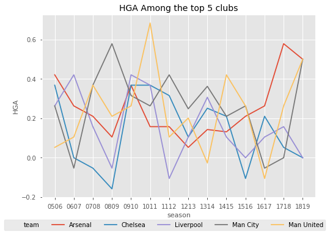

The results here seem to be quite erratic, although it seems that Arsenal consistently has a HGA above 0.

Let's now look at the distributions of each of our columns. The odds columns are likely to be highly skewed, so we may have to account for this later.

```python
for col in df.select_dtypes('number').columns:
    sns.distplot(df[col])
    plt.title(f"Distribution for {col}")
    plt.show()
```

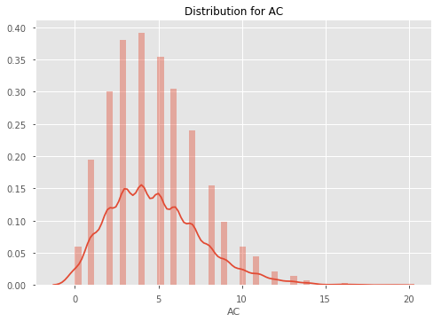


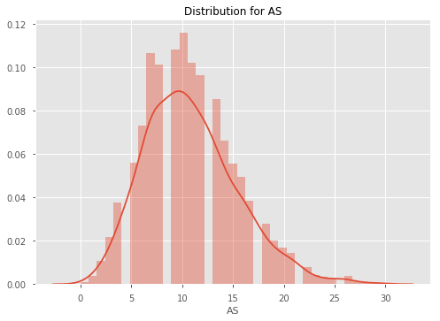

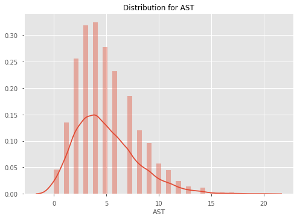

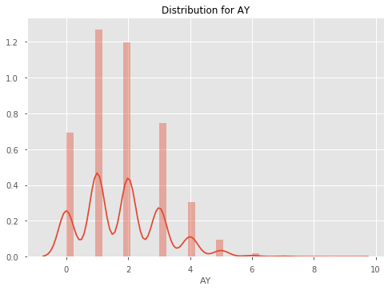

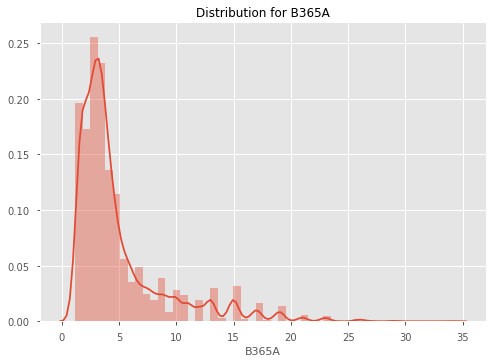


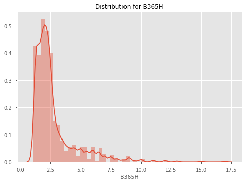


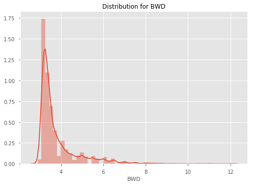


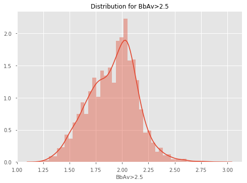

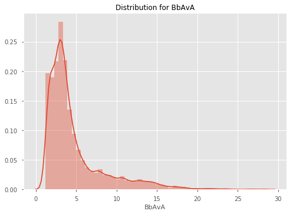


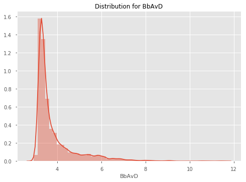


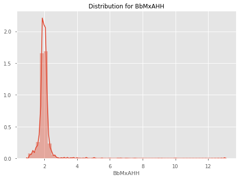


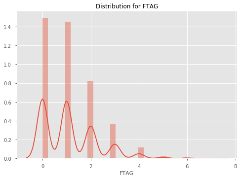

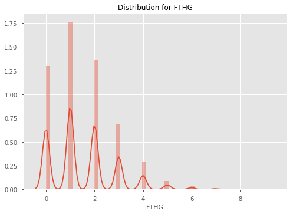


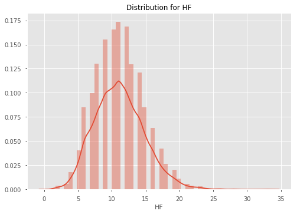


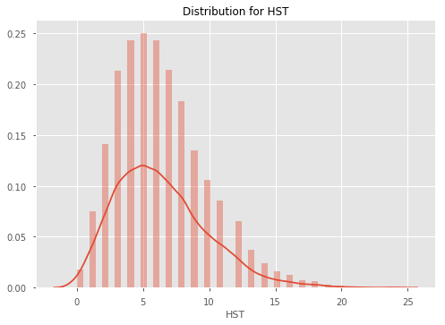

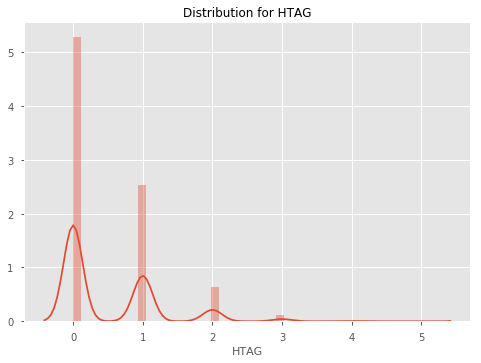


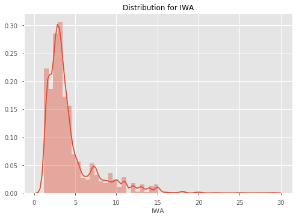


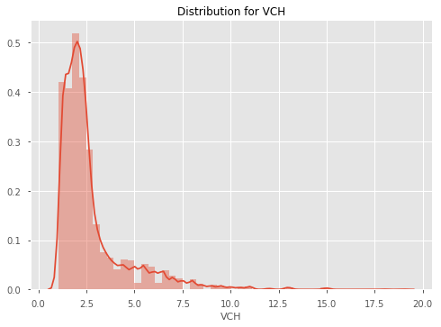


---
## Exploring Referee Home Ground Bias
What may be of interest is whether certain referees are correlated with the home team winning more often. Let's explore referee home ground bias for referees for the top 10 Referees based on games.

```python
print('Overall Home Win Rate: {:.4}%'.format(df.homeWin.mean() * 100))

# Get the top 10 refs based on games
top_10_refs = df.Referee.value_counts().head(10).index

df[df.Referee.isin(top_10_refs)].groupby('Referee').homeWin.mean().sort_values(ascending=False)
```
    Overall Home Win Rate: 46.55%
    
    Referee
    L Mason          0.510373
    C Foy            0.500000
    M Clattenburg    0.480000
    M Jones          0.475248
    P Dowd           0.469880
    M Atkinson       0.469565
    M Oliver         0.466019
    H Webb           0.456604
    A Marriner       0.455516
    M Dean           0.442049
    Name: homeWin, dtype: float64

It seems that L Mason may be the most influenced by the home crowd. Whilst the overall home win rate is 46.5%, the home win rate when he is the Referee is 51%. However it should be noted that this doesn't mean that he causes the win through bias. It could just be that he referees the best clubs, so naturally their home win rate is high.

---
## Variable Correlation With Margin
Let's now explore different variables' relationships with margin. First, we'll create a margin column, then we will pick a few different variables to look at the correlations amongst each other, using a correlation heatmap.

```python
df['margin'] = df['FTHG'] - df['FTAG']
```

```python
stat_cols = ['AC', 'AF', 'AR', 'AS', 'AST', 'AY', 'HC', 'HF', 'HR', 'HS', 'HST', 'HTR', 'HY', 'margin']

stat_correlations = df[stat_cols].corr()
stat_correlations['margin'].sort_values()

    AST      -0.345703
    AS       -0.298665
    HY       -0.153806
    HR       -0.129393
    AC       -0.073204
    HF       -0.067469
    AF        0.005474
    AY        0.013746
    HC        0.067433
    AR        0.103528
    HS        0.275847
    HST       0.367591
    margin    1.000000
    Name: margin, dtype: float64
```

Unsurprisingly, Home Shots on Target correlate the most with Margin, and Away Reds is also high. What is surprising is that Home Yellows has quite a strong negative correlation with margin - this may be because players will play more aggresively when they are losing to try and get the lead back, and hence receive more yellow cards.

Let's now look at the heatmap between variables.

```python
sns.heatmap(stat_correlations, annot=True, annot_kws={'size': 10})
    <matplotlib.axes._subplots.AxesSubplot at 0x220a4227048>
```


---
## Analysing Features
What we are really interested in, is how our features (creating in the next tutorial), correlate with winning. We will skip ahead here and use a function to create our features for us, and then examine how the moving averages/different features correlate with winning.

```python
# Create a cleaned df of all of our data
pre_features_df = create_df('data/epl_data.csv')

# Create our features
features = create_feature_df(pre_features_df)
    Creating all games feature DataFrame
    
    C:\Users\wardj\Documents\Betfair Public Github\predictive-models\epl\data_preparation_functions.py:419: RuntimeWarning: invalid value encountered in double_scalars
      .pipe(lambda df: (df.eloAgainst * df[goalsForOrAgainstCol]).sum() / df.eloAgainst.sum()))
    
    Creating stats feature DataFrame
    Creating odds feature DataFrame
    Creating market values feature DataFrame
    Filling NAs
    Merging stats, odds and market values into one features DataFrame
    Complete.
```
   
```python
features = (pre_features_df.assign(margin=lambda df: df.FTHG - df.FTAG)
                           .loc[:, ['gameId', 'margin']]
                           .pipe(pd.merge, features, on=['gameId']))
```

```python
features.corr().margin.sort_values(ascending=False)[:20]

    margin                     1.000000
    f_awayOdds                 0.413893
    f_totalMktH%               0.330420
    f_defMktH%                 0.325392
    f_eloAgainstAway           0.317853
    f_eloForHome               0.317853
    f_midMktH%                 0.316080
    f_attMktH%                 0.312262
    f_sizeOfHandicapAway       0.301667
    f_goalsForHome             0.298930
    f_wtEloGoalsForHome        0.297157
    f_shotsForHome             0.286239
    f_cornersForHome           0.279917
    f_gkMktH%                  0.274732
    f_homeWinPc38Away          0.271326
    f_homeWinPc38Home          0.271326
    f_wtEloGoalsAgainstAway    0.269663
    f_goalsAgainstAway         0.258418
    f_cornersAgainstAway       0.257148
    f_drawOdds                 0.256807
    Name: margin, dtype: float64
```

As we can see away odds is most highly correlated to margin. This makes sense, as odds generally have most/all information included in the price. What is interesting is that elo seems to also be highly correlated, which is good news for our elo model that we made. Similarly, weighted goals and the the value of the defence relative to other teams ('defMktH%' etc.) is strongly correlated to margin.