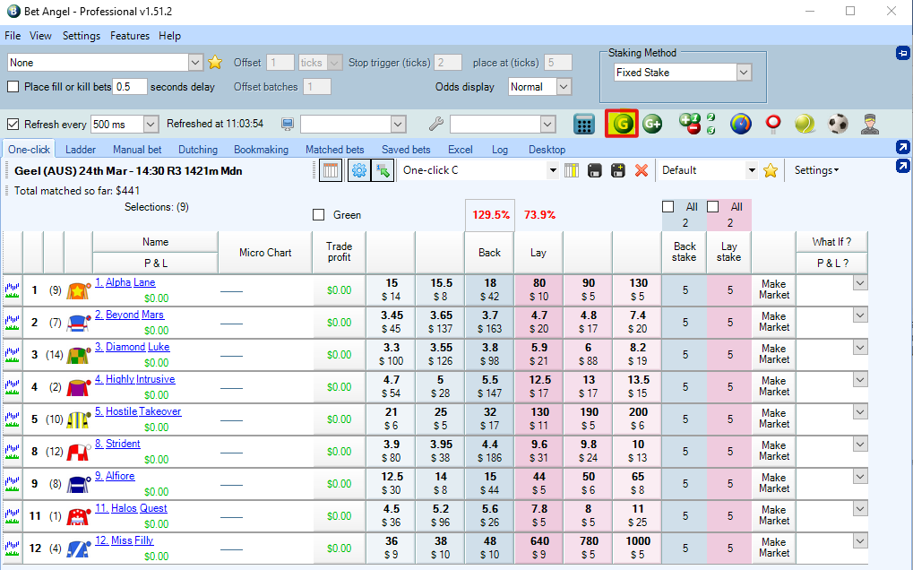
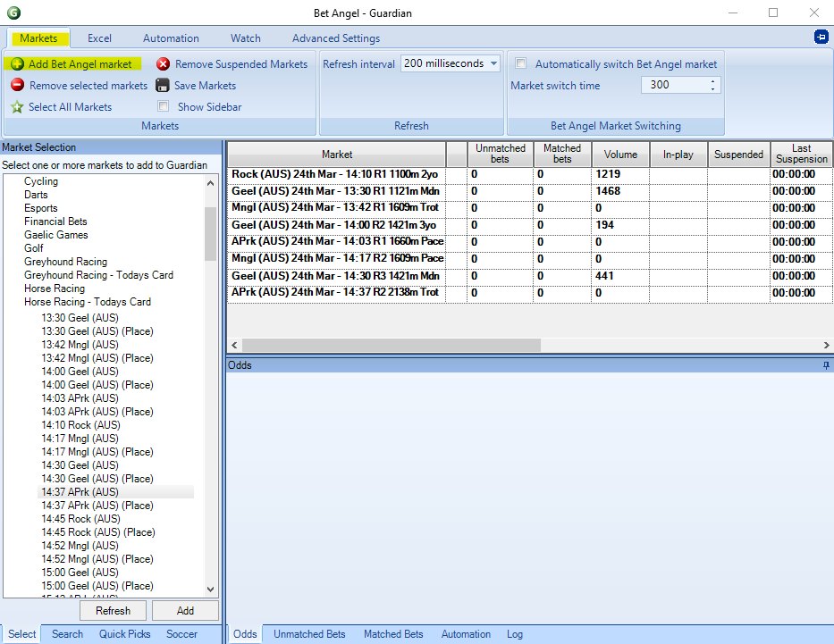
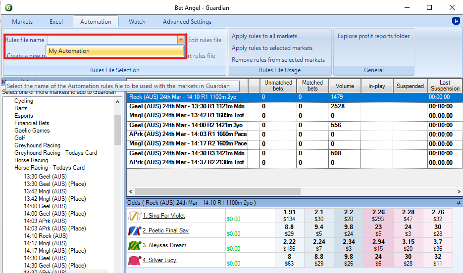
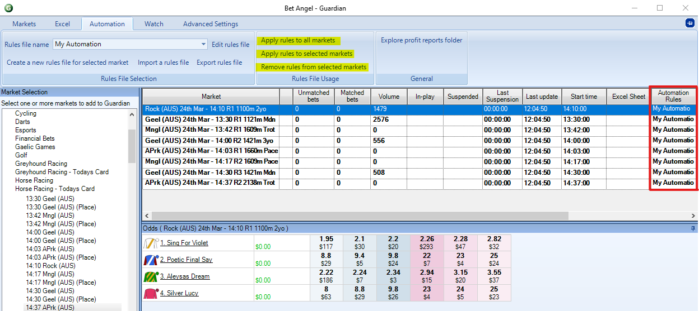
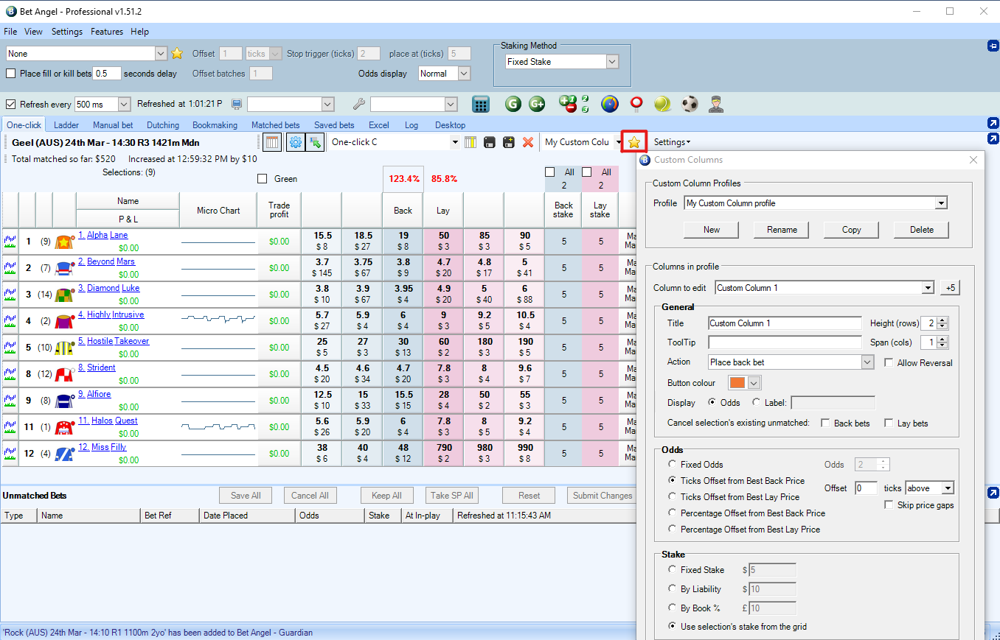
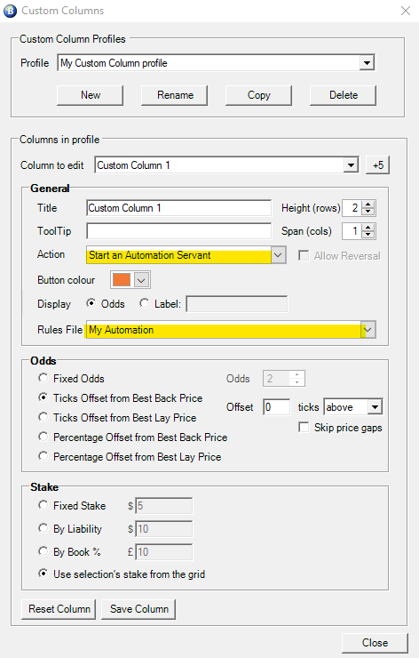
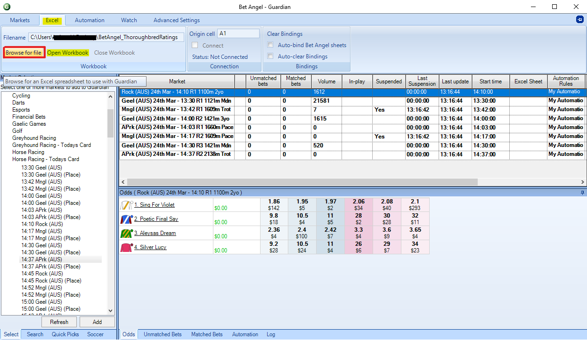

# Bet Angel: An Advanced guide
---
## Automation

Bet Angel offers two forms of automation through their Guardian interface: 

1. Triggered betting which operates by linking pre-defined commands together to form an automated strategy 

2. Use Excel to monitor multiple markets and execute bets or trades based upon triggers set within the Excel spreadsheet within one or more markets. 

The triggered betting feature is a good way to implement simple automations quickly while using Excel gives you a greater level of control and sophistication as you have the ability to use formulas and even create your own macros using Visual Basic for Applications (VBA).  

## Triggered Betting

To begin forming your automation in the triggered betting feature within Bet Angel, you will need to open the Guardian feature by clicking on the  icon on the main Bet Angel toolbar. 

The Guardian window will open where you have a number of tabs to select from. First, we want to have a list of markets that we want to automate.  

- From the ‘Market Selection’ tab select each market (use Ctrl to select multiple) you want 

- Click the ‘Add Bet Angel markets’ button.  

- Keep in mind that the order that the markets are in the list, will be the order that your automation will go through.  

Tip: Click on the ‘Start time’ column to order your list based on race start time. Guardian will work through your list in order. 

Within the ‘Markets’ tab you will see the ‘Refresh interval’ dropdown box. This instructs Bet Angel how often to refresh the markets in the list.  

We recommend setting this value to be the lowest possible by: 

- Navigate back to the Main Bet Angel home screen 
- Click the ‘Settings’ tab  
- Select ‘Edit Settings’ 
- Click the ‘Communications’ tab  
- Check ‘Use Exchange Streaming’ 
- Click ‘Save’ then ‘Close’ 
- Navigate to the Guardian screen and select ‘20ms’ from the ‘Refresh interval’ dropdown box. 

For triggered betting automations: 

- Click on the ‘Automation’ tab  

You can create an automation file from scratch and apply it to your selected markets or import other people's Bet Angel automation files.  

To get started: 

- Highlight one of the markets in your list and  
- select ‘Create a new rules file for the selected market’. 

The Automation rules editor window will appear where you can start defining all the settings needed for your automation. Rule settings are divided into 5 different tabs: 

- ‘General’ – where the type of action is defined and when that action will be triggered in relation to the market 
- ‘Parameters’ – Here you’ll specify the finer details of your bets such as the odds, stake and global settings 
- ‘Conditions’ – create the conditions that have to be met before the rule triggers such as the markets weight of money or volume 
- ‘Signals’ – for more complex automations, you may choose to set your rule to give off a certain signal when it triggers which in turn will cause other rules to trigger when they’re set to listen for that signal 
- ‘Stored Values’ – which allows you to record things like a Back or Lay bet, last traded price or volume which then can be used as conditions for other rules.  

There’s a lot of options here, so we recommend taking a look at online resources such as the [Bet Angel user guide](https://www.betangel.com/user-guide/advanced_automation__triggered_betting_.html?ms=DAAgAAAAQBBA&st=MA%3D%3D&sct=NjQ1&mw=MzIw) and [Youtube tutorials](https://www.youtube.com/watch?v=XoOo9yNqqHc) to get a more in depth understanding of what each option does and how it may apply to your specific strategy.  

Once you have finished creating your automation, remember to click the save icon and give it a name. 

Now you can close the Automation Rules editor window and select your automation from the drop down box called ‘Rules file name’. 

Once your automation rule file is selected, in the ‘Rules File Usage’ you can choose from: 

1. ‘Apply rules to all markets’, 
2. ‘Apply rules to selected markets ‘ 
3. ‘Remove rules from selected markets’.  

When your automation file is linked to a market it will appear in the ‘Automation Rules’ column and will begin automating your strategy for you. 

## Custom columns - Advanced

Please see our [Intermediate guide on custom columns here](/thirdPartyTools/betAngelintermediate) before starting this advanced tutorial. 

Custom columns can be very useful to tailor your betting experience when placing manual bets. They can also be used to trigger betting automations. 

To link an automation to a custom column, click the star icon on the ‘One-click’ betting screen which will bring up your custom column settings window.  

- Select ‘Start an Automation Servant’ from the ‘Action’ drop down box (highlighted below) 
- Then from the ‘Rules File’ drop down box select the name of your automation file.  
- Add steps here (same as intermediate tute) to add the column 

After you’ve saved the settings for your custom column, whenever the custom column is clicked on, it will trigger your automation. Applications for this can be varied such as backing a specific runner while laying the rest of the field and much more. 

## Excel Automation

Using an excel spreadsheet is a great tool to implement complex strategies through Bet Angel. The main way you will go about setting up an automation is to control when a back, lay or take SP command is printed into specific cells which Bet Angel continuously checks.  

If Bet Angel detects that a certain cell contains “BACK”, it will place a back bet. The same applies with lay bets as well. Formulas and macros can be used to control when these messages are sent to Bet Angel which can be tied into various market factors or conditions.  

To begin setting up an Excel automation:  

- click on the  icon to open Guardian 
- and then click the Excel tab.  

From here, you can choose a specific Excel template that you have set up on your computer or import an automation that has been downloaded online using: 

- ‘Browse for file’ button  
- and then clicking ‘Open workbook’. 

By default, Bet Angel won't automatically start using the Excel sheet to start placing bets until you check the boxes next to:  

- ‘Connect’,  
- ‘Auto-bind Bet Angel sheets’ and 
- ‘Auto-clear bindings’ options.   
- Then select your file name from the ‘Excel Sheet’ column next to the markets you want to connect 

Once this is done, Bet Angel will start populating your spreadsheet with market data and start listening for the betting commands. 

If you try to edit the Excel sheet while it’s connected with Bet Angel it will most likely cause an error. If you want to make changes to your Excel workbook, simply untick the ‘Connect’ option in Guardian, make your changes and re select connect.  

As previously mentioned, Bet Angel will populate data into specific cells and will listen for betting commands from other specific cells. You will need to be mindful of this If you wish to start adding functionality to your excel workbook to make sure that you’re not placing it in a cell/s that Bet Angel will use. Bet Angel will simply override whatever you have entered with its own data.  

For more tutorials on using the Bet Angel Excel function, take a look through our Automation Hub where we have created a number of tutorials for different strategies.  

## Resources

- [Betfair's interview with Bet Angel's creator, Peter Webb](https://www.betfair.com.au/hub/peter-webb/)

- [Bet Angel User Guide](https://www.betangel.com/user-guide/)
    - [Triggered Betting](https://www.betangel.com/user-guide/advanced_automation__triggered_betting_.html?ms=AAAAAAAA&st=MA%3D%3D&sct=MTAw&mw=MzIw)
    - [Custom Columns](https://www.betangel.com/user-guide/custom_columns.html?ms=BAAAAAAAEA%3D%3D&q=Y3VzdG9t&st=Mg%3D%3D&sct=MA%3D%3D&mw=MzIw)
    - [Excel Automation](https://www.betangel.com/user-guide/microsoft_excel_integration.html?ms=BgAAAAAAARA%3D&q=Y3VzdG9t&st=Mg%3D%3D&sct=MA%3D%3D&mw=MzIw)

- [Youtube](https://www.youtube.com/user/betangeltv)
    - [Triggered Betting](https://www.youtube.com/watch?v=XoOo9yNqqHc&t=1503s)
    - [Custom Column (Advanced)](https://www.youtube.com/watch?v=-0ShD87g21w)

- [Automation Hub](https://betfair-datascientists.github.io/)
    - [Ratings Automation tutorial](https://betfair-datascientists.github.io/thirdPartyTools/betAngelRatingsAutomation/)
    - [Market favourite automation](https://betfair-datascientists.github.io/thirdPartyTools/betAngelMarketFavouriteAutomation/)
    - [Tipping automation tutorial](https://betfair-datascientists.github.io/thirdPartyTools/betAngelTippingAutomation/)
    - [Simultaneous markets tutorial](https://betfair-datascientists.github.io/thirdPartyTools/betAngelSimultaneousMarkets/)
    - [Kelly criterion staking tutorial](https://betfair-datascientists.github.io/thirdPartyTools/betAngelSimultaneousMarkets/)

---

## Disclaimer

Note that whilst automated strategies are fun and rewarding to create, we can't promise that your betting strategy will be profitable, and we make no representations in relation to the information on this page. If you're implementing your own strategies, you do so entirely at your own risk and you are responsible for any winnings/losses incurred.  Under no circumstances will Betfair be liable for any loss or damage you suffer.