# Bet Angel: A beginner’s guide 
---
## Installing Bet Angel

Bet Angel offers three products for use with Betfair. We’ll be using Bet Angel Professional in these tutorials as it is the Ultimate Trading Toolkit containing all the advanced tools and features every trader needs. To start using and learning Bet Angel Professional, first you need to download and install the program from the Bet Angel website.  

By downloading it from the Bet Angel website, you can ensure that you’re installing the most up to date version of the software which can be obtained from [here.](https://www.betangel.com/trial/) Make sure that you save the downloaded .exe file somewhere that you can easily access. Once it has finished downloading, double click the file (which will be called BAP_1_54_1.exe or something similar) to begin the setup process. For more details on downloading and installing Bet Angel see their handy [user guide here.](https://www.betangel.com/user-guide/downloading_and_installing_bet_angel.html?ms=AQAAAAAAQA%3D%3D&st=MA%3D%3D&sct=MA%3D%3D&mw=MzIw) 

Follow the prompts throughout the installation and once completed, open Bet Angel Professional.  

--- 
## Registering Bet Angel

<b>Step 1</b> 
After opening Bet Angel Pro you will see a login dialogue box. Click on the ‘Register using a serial number…’ button (highlighted below).  

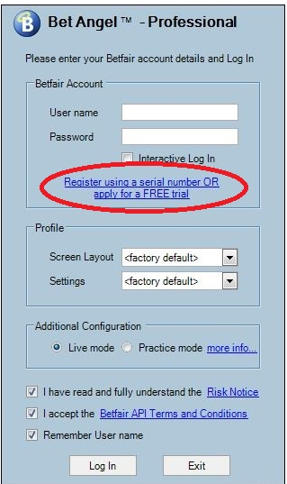

<b> Step 2 – Free Trial. (Skip to Step 4 if you already have a Bet Angel license). </b> 
Bet Angel offer a free 14-day trial for first time users. Select the option “I wish to register for a FREE trial…” as highlighted below. Then enter your “Betfair User Name” and “Password” details, and click ‘Register Account’. 

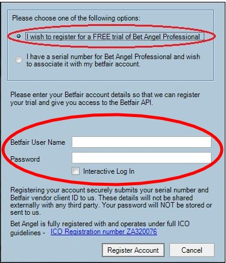

<b> Step 3</b> 

A new window will appear where you will be prompted to provide your first and last name along with your email address. From here you’ll need to verify your email by clicking a link that will be sent to you in an automated email by Bet Angel. If you don’t see an automatic email from Bet Angel, make sure you check your junk / spam folder.  

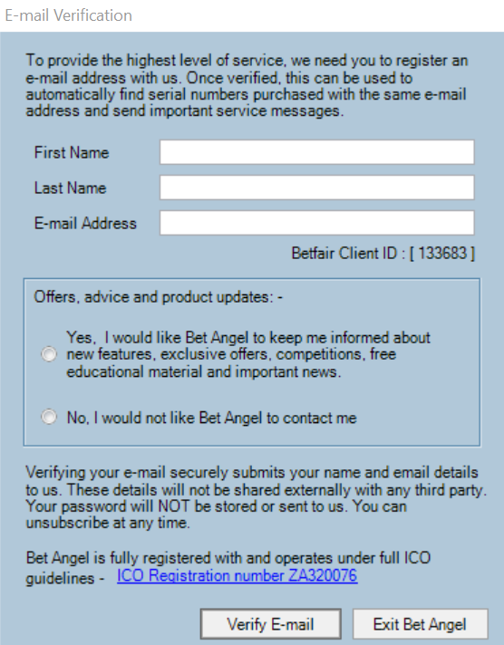

<b> Step 4 – Purchased serial number (Skip to Step 5 if you have registered for a free trial) </b> 

Select “I have a serial number......”. You will now see a registration box in which you must enter the serial number sent to you along with the Betfair account username and password (for account verification). Your account password will NOT be stored or sent to us. 

Once you have entered your details click on the “Register Account” button. 

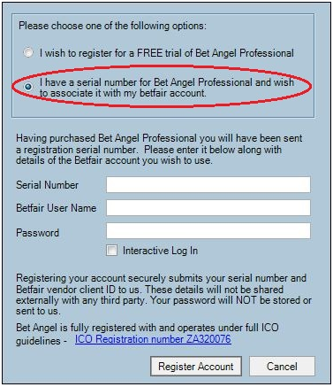

If you have not already done so a window will appear asking you to first associate a verified e-mail address with your Betfair Client ID. 

This is a one-time process and will make activating future subscriptions much quicker and easier. Otherwise immediate access will be granted, and a confirmation message will appear on your screen. 

<b> Step 5</b> 

Once you have submitted your register account request, log into Bet Angel by entering your “Betfair User Name” and “Password” in the boxes highlighted below. You can select either “Live mode” or “Practice mode” at the log in screen.  

We recommend starting in Practice mode as this will allow you to experiment with Bet Angel without placing any bets to the Betfair exchange which is great while learning the ropes.  

Note that it can take up to 15 minutes before you have full access to Bet Angel, so be patient while the system sets you up in the background.  

Ensure that you tick the “I have read and fully understand the risk notice” and the “I accept the Betfair API Terms and conditions” boxes and then click the “Log in” button. 

---
## Basic Setup

Once we’re logged into Bet Angel, the first thing that we’re going to want to do is to configure Bet Angel so that it behaves in a way that is best suited for what we’re going to use it for. Each user will have their own configuration preferences and we strongly recommend getting acquainted with the various options available to take full advantage of your Bet Angel experience. To understand all of the options available in Bet Angel, we recommend taking a look at the [Bet Angel user guide.](https://www.betangel.com/user-guide/index.html) 

 

To get started, simply click the ‘Settings’ tab from the top toolbar and then ‘Edit settings’ from the drop-down box.  

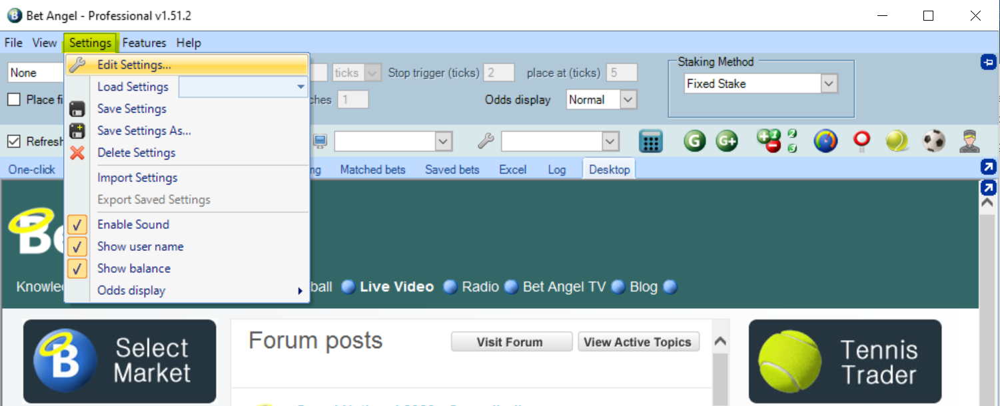

The Settings window will then appear and is organized into 10 sections;  

- <b>Display:</b> to alter the colour preferences for market views, font size and weight of money 
- <b>Staking:</b> where you can set default stakes and liabilities which will be applied to every market 
- <b>Behavior:</b> Enable / disable confirm bet warnings as well as other program specific warnings 
- <b>Green Up:</b> Specific options that affect unmatched bets when closing / greening a trade 
- <b>Communications:</b> Control the data that Bet Angel is pulling from the Betfair exchange API 
- <b>Ladder:</b> Change the colour scheme, columns, charts and more for the ladder functionality 
- <b>Automation:</b> Modify some basic automation controls for bookmaking, ditching, Back and Lay 
- <b>Charts:</b> Customise how charts are displayed in Bet Angel such as colour 
- <b>Sound Alerts:</b> change what sounds will be heard from Bet Angel such as market jump warnings 
- <b>Excel:</b> Control additional information which is populated in a connected excel sheet such as saddle cloth numbers, stall number projected / actual SP and more.  

The most common settings to edit straight away are:  
- Turning off “Confirm Bets”  - As it states, unticking this option will mean you don’t need to confirm bets. This is one of the advantages of using a 3rd party tool – please be aware that this will make betting faster, <b>so gamble responsibly</b>. 

- To use the ladder functionality within Bet Angel, go to the Ladder tab and then  click ‘Show the Ladder Settings editor’ which will bring up another window with a lot more options to play with. A lot of users like to enable the “Show last traded volume” option by 
    - Clicking on the “General” tab and then check “Show last traded volume” then 
    - Clicking on the “Columns” tab and under ‘Last traded price chart column’ (near top of window) check the ‘Show chart column’ box. 

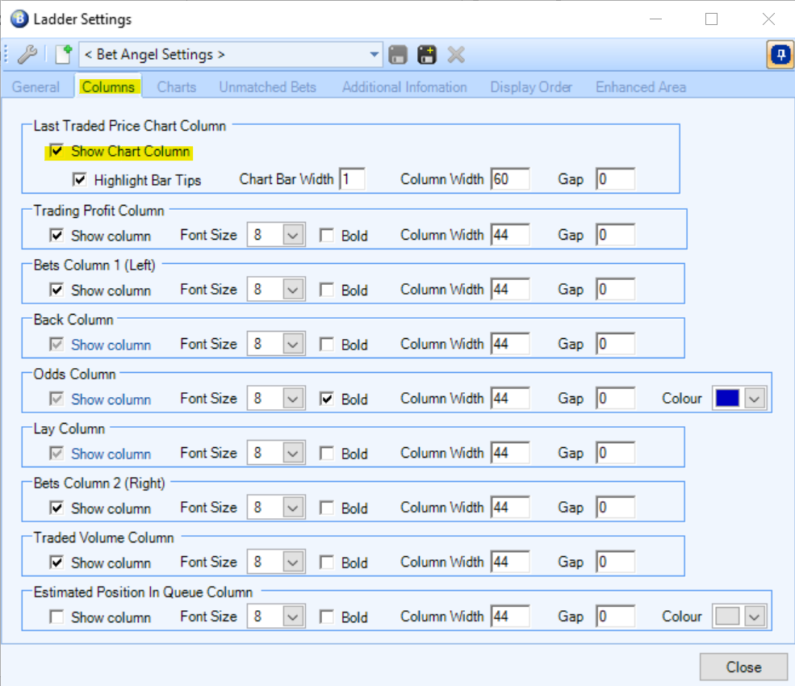

Whatever settings you decide to use, you can save them as a settings profile and use different profiles for different types of betting. Just click ‘save’ from the Settings window and give your settings profile a name.  

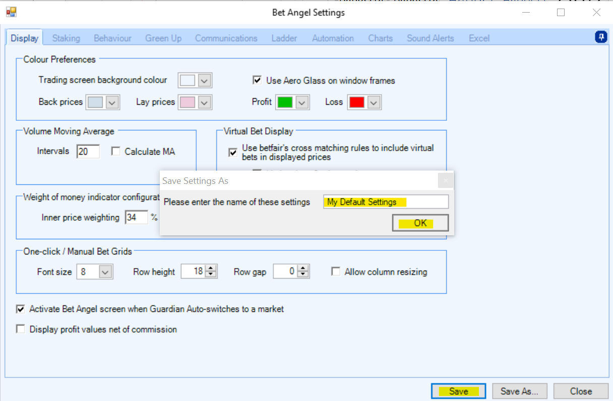

You can easily switch between different settings profiles that you’ve created by clicking the ‘Settings’ tab and then choosing the profile name from the dropdown box next to ‘Load settings’  

To help you through getting setup in Bet Angel, take a look at the [Bet Angel: Recommended Settings From Betfair on the Betfair Hub](https://www.betfair.com.au/hub/bet-angel-recommended-settings-from-betfair/) created specifically to help you get up and running.  

---

## Market Selection

To open a market so we can start placing bets, first we need to select the market that we want to look at. Click the ‘File’ tab from the main navigation bar and click ‘Select Market’. 

This will open the “Market Selection” window where you can browse all the different markets available on the Betfair exchange. Click the arrows to the left of the menu items to expand and see the specific markets available.  

Once you’ve found a market that you’re interested in, 

- click on it once then  
- click the ‘switch to market’ button.   

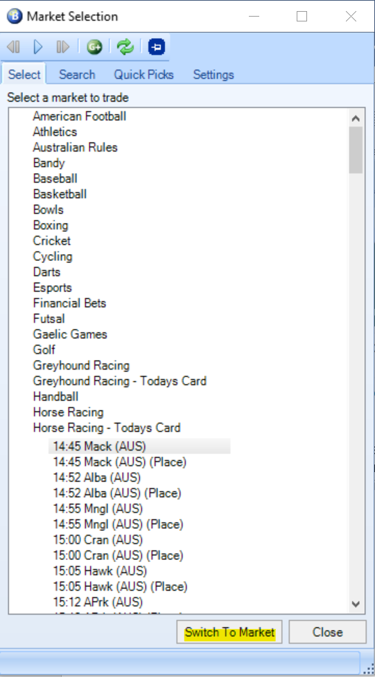

Another handy feature is to create a quick pick list for specific markets that you’re interested in. For example, if you’re only interested in win horse racing markets within Australia, you can click the “Settings” tab in the “Market Selection” window and modify the options to be applicable to what you’re interested in. For example here we have selected Australian Horse Race Win markets by: 

- Checking the “AUS” box under “Horse Races”  
- Checking the “Win Markets” under “Horse Races” 
- Checking the box next to “Display event start time first”

Then only those markets will appear in the ‘Quick Picks’ tab. 

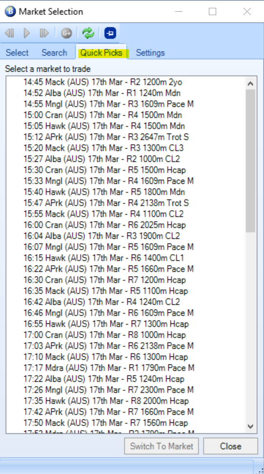

Once you have clicked the ‘Switch to market’ button for your chosen market, you can easily cycle through to the next scheduled market by pressing Ctrl+N (or Ctrl+P for the previous market) without the need to return back to the market selection window. 

---

## Default stakes and lay to a maximum liability

If you’re a person who wants to place bets quickly in order to secure the best price, then you’ll also want to be able to set a default stake for your bets.  

In a market, you’ll see two columns named ‘Back stake’ and ‘Lay stake’. You can easily change the stake value for each runner to whatever you like by clicking on the number and entering your own value manually.  

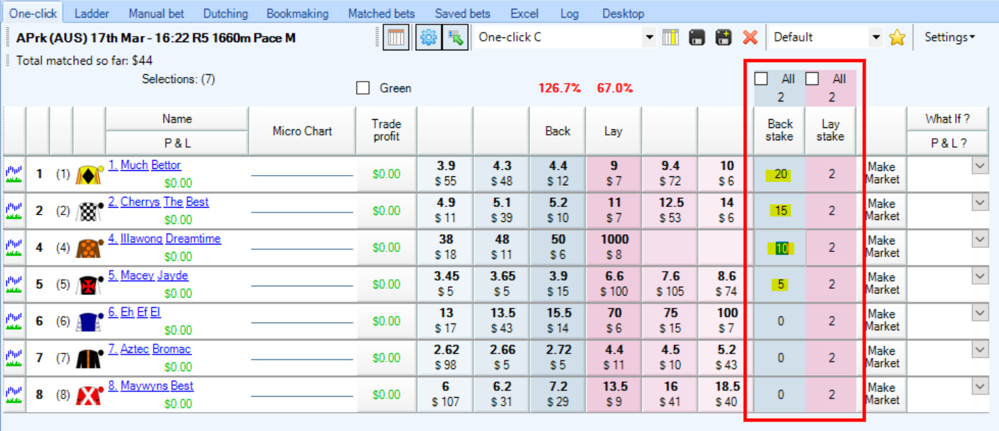

You can also set a default stake that will apply to all runners within a market. Simply change the value at the top of the column (highlighted in yellow) and ensure the ‘All’ check box is selected. 

This can also be done for the lay column in the exact same way.  

But what if we wanted to set a maximum liability for our lay bets as opposed to a straight stake? This is where the staking method option comes into play.  

Simply change the “Staking Method” drop down box (top of screen) to ‘By Liability (Lay only)’ and any values which are entered in the lay stake column becomes your maximum liability. Your lay stake is calculated behind the scenes to ensure that you don’t accidentally empty your Betfair account should your lay bet lose.  

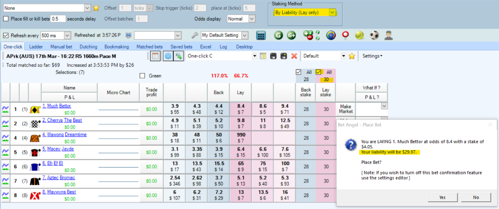

---

## One click betting

Previously, we went over the available settings in Bet Angel to switch off an option called ‘Confirm bets?’ under the ‘Behavior’ tab of the settings window. This option is usually enabled by default and will cause a pop-up window to appear asking for you to confirm whether you want a bet to be placed on the exchange.  

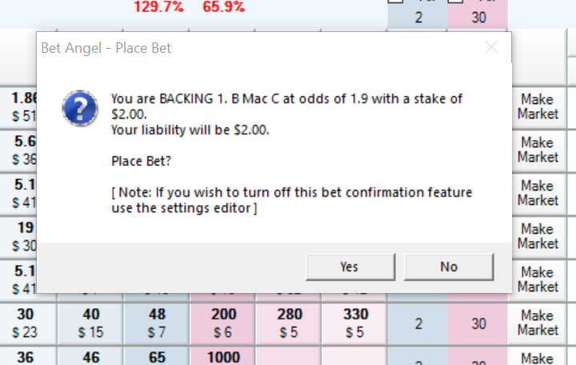

By switching this setting off, you can place bets onto the exchange using a single click meaning that you can react much faster to changes in a market. This will also affect other views within Bet Angel such as the ladder feature within Bet Angel.  

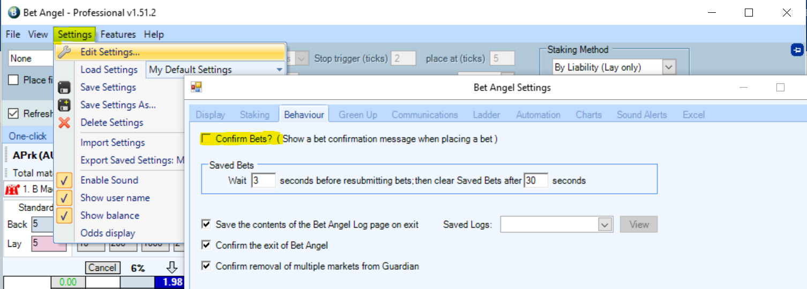

---

## Refresh Settings

Bet Angel gives you the ability to control how often data is refreshed from the Betfair exchange through a number of options in settings. We recommend making sure that the refresh rate for Bet Angel is set to as low as possible to ensure that you are seeing the most up to date data at any one time.  

- Click the ‘Settings’ tab and then  
- Select ‘Edit Settings’ and then 
- Click the ‘Communications’ tab.  
- Check ‘Use Exchange Streaming’ 
- Click ‘Save’ then ‘Close’. 

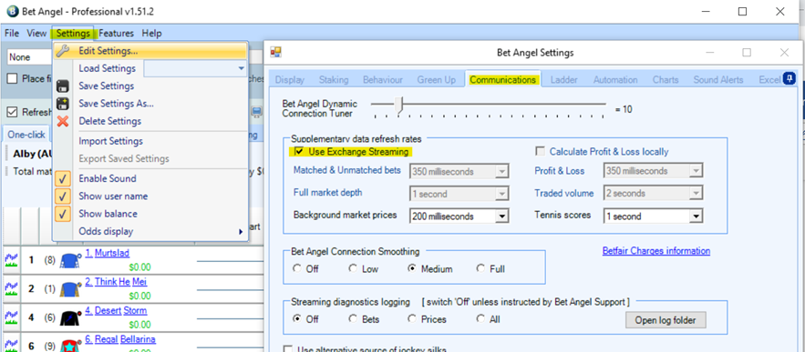

On the Bet Angel menu bar, change the ‘Refresh every’ option to 20ms (note 20ms will only be available if you have checked ‘Use Exchange Streaming’ in the previous step). 

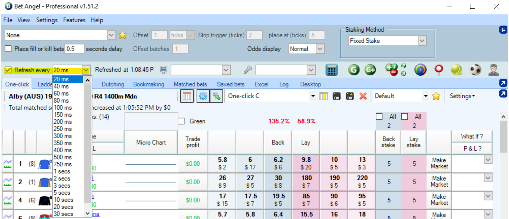

---

## Fill or Kill

Fill or kill is a useful tool to instruct Bet Angel to cancel (kill) a bet if it’s not matched within a period of time you have specified. To set up fill or kill, simply follow the following steps:

- Ensure that the ‘Use Global Settings when placing a bet’ is enabled (see highlighted button below) 

- Tick ‘Place fill or Kill bets’ in the header menu 

- In the ‘seconds delay’ box specify the number of seconds you would like Bet Angel to wait until it cancels the bet should it not be matched. Bet Angel recommends to ensure that a minimum value of 0.5 (half a second) is always applied to the fill or kill.  

---

## Resources

- [Betfair's interview with Bet Angel's creator, Peter Webb](https://www.betfair.com.au/hub/peter-webb/)

- [Bet Angel User Guide](https://www.betangel.com/user-guide/)
    - [Installation](https://www.betangel.com/user-guide/downloading_and_installing_bet_angel.html?ms=AQAAAAAAQA%3D%3D&st=MA%3D%3D&sct=MA%3D%3D&mw=MzIw)
    - [Settings](https://www.betangel.com/user-guide/bet_angel___settings_tool.html?ms=AQAAAAAAQA%3D%3D&st=MA%3D%3D&sct=OTA3LjMzMzMxMjk4ODI4MTI%3D&mw=MzIw)
    - [Market Selection](https://www.betangel.com/user-guide/market_selection_1.html?ms=EQAAAAAAQAg%3D&st=MA%3D%3D&sct=MjAxLjMzMzMyODI0NzA3MDM%3D&mw=MzIw)
    - [One Click betting](https://www.betangel.com/user-guide/one_click_trading_screen.html?ms=EgAAAAAAAQg%3D&st=MA%3D%3D&sct=MzcuMzMzMzMyMDYxNzY3NTg%3D&mw=MzIw)
    - [Refresh settings](https://www.betangel.com/user-guide/refreshing_the_market_odds.html?ms=EgAAAAAAAwg%3D&st=MA%3D%3D&sct=Mzg1LjMzMzM0MzUwNTg1OTQ%3D&mw=MzIw)
    - [Fill or Kill](https://www.betangel.com/user-guide/fill_or_kill_.html?ms=EgAAAAAAAwg%3D&st=MA%3D%3D&sct=Mzg1LjMzMzM0MzUwNTg1OTQ%3D&mw=MzIw)

- [Youtube](https://www.youtube.com/user/betangeltv)cccc
    - [Using the settings feature](https://www.youtube.com/watch?v=DWn7RRFSt_g)
    - [One click trading screen](https://www.youtube.com/watch?v=AU0oj9jAFK8)
    - [Getting Bet Angel to update ten times faster - Refresh settings](https://www.youtube.com/watch?v=QOMx7s7XIAA)

- [Betfair Hub](https://www.betfair.com.au/hub/)
    - [Bet Angel overview](https://www.betfair.com.au/hub/bet-angel-betting-app/)
    - [Recommended settings from Betfair](https://www.betfair.com.au/hub/bet-angel-recommended-settings-from-betfair/)

---
## What next? 

---
## Disclaimer

Note that whilst automated strategies are fun and rewarding to create, we can't promise that your betting strategy will be profitable, and we make no representations in relation to the information on this page. If you're implementing your own strategies, you do so entirely at your own risk and you are responsible for any winnings/losses incurred.  Under no circumstances will Betfair be liable for any loss or damage you suffer.