# Staking Strategy - Betfair Hub Thoroughbred Predictions Model 

## What is the ratings model?
[The Ratings Model](https://www.betfair.com.au/hub/racing/horse-racing/predictions-model/) provides rated prices for every runner at selected thoroughbred meetings across Australia, offering data driven horse racing predictions.

Using Punting Form data, the model is able to calculate its prediction of each runner’s percentage chance of winning that race, before then converting it to what it believes that runner’s most accurate odds should be, a.k.a. that runner’s rated price.

Using these rated prices, Betfair customers can then compare the model’s price to that of the price on offer on the Exchange to see which horses the horse racing predictor model believes is good and bad value.

The model can help you identify value, outlining the value percentage of each runner in the race where applicable.

## How do I read the ratings?
Ratings are numerical measures that are an expected rating for each horse for the upcoming meeting. Prices are formulated by multiple factors including past performance, upcoming race conditions, trainer and jockey statistics and a range of other variables considered by our Data Scientists.

NB: The Data Scientists’ best-profiled runner is highlighted in grey. The ‘Value’ % is calculated looking at the difference in win probability based on the Analysts rated price v current Exchange market price.

A 20% win rated chance vs 12.5% win chance in the market is a 7.5% difference in winning chance. This is calculated by: (1 / model odds) – (1 / price).

---
## How can I approach betting this model?

There are several ways in which you could slice and dice the historical ratings to try to come up with an edge that you could transform into a potentially profitable betting strategy. 

Some of the potential features you could include in such an analysis are:

- Race Type (e.g. Handicaps, Maidens, Group Races etc.)
- Race Distance (segmented into buckets like Spring, Middle, Staying)
- Model Rank (How a horse has been rated compared to other horses in the race)
- Number of Runners (Does too many runners introduce too much variance?)
- Implied Value (The difference in implied winning probability between the rated price and the BSP)
- Track / State (Is the 10% MBR in NSW too difficult to find an edge with? Or are TAS races are bit weird?)

All of these features you can implement using the data on our [data listing page](https://betfair-datascientists.github.io/data/dataListing/).

Using an external data source, it is possible to further segment this information.

## Staking Strategies

Once you've done some segmentation, then it's time to look at different staking strategies. There are a significant number of different ways in which you could bet on a selection and we'll explore a couple here.

If you decide that a selection is worth backing, either for the confidence the model has in it or the under confidence the market has in it (corresponding to a higher available price than the rated price), then you could use a flat staking model, where you simply decide to put the same amount on every selection regardless of price.

Proportional staking is also another option. This means taking a fixed stake for a whole market, say $100, and then assigning a proportion of this stake to the implied winning probability given by the rated price.
If a horse has a rated price of $5, this implies a winning probability of 20% (1/5). So the proportional stake for a $100 total stake would be 20% of $100 or $20.

If, on the other hand, you believe the selection is worth laying, because the market over values it, then you could use a fixed liability at BSP to lay it. 
Proportional liability is possible to use as well, except this isn't possible to do at BSP as you can't know what the BSP is going to be to figure out your proportional liability.

## Analysis of the Horse Racing Predictions Model

All of the below graphs showcase the 2023 ratings and results from the predictions model for the top 2 horses in each race using implied value between the rated price and the BSP with negative value (good lays) on the left and positive value (good backs) on the right.

A profitable strategy could include using a value range between a trough on the left and a peak on the right which shows the highest profitability.
However, these results are before commission so may not be genuinely profitable. They are simply an illustration of how different variables can affect performance of a model in betting markets.

We will showcase a flat back, proportional back and flat lay strategy.

For the purposes of this analysis we have segmented data on the below definitions:

- Sprint <=1200m
- Middle 1201m-2040m
- Staying >2041m
- Win Restricted (Maiden, CL1-CL6)
- Handicap
- Other (WFA, Qlty, Grp1-3, Hrd, Stpl, 2-5yo, Listed, Cup)

In these graphs, going from left to right is the cumulative profit associated with betting the top 2 horses in the race as chosen by the model by the implied value of the price against the BSP.
We have previously done [another tutorial](https://betfair-datascientists.github.io/tutorials/backtestingRatingsTutorial/) where we analysed this model using python and the graphs there display profit against time (or number of bets)

---
### All Races

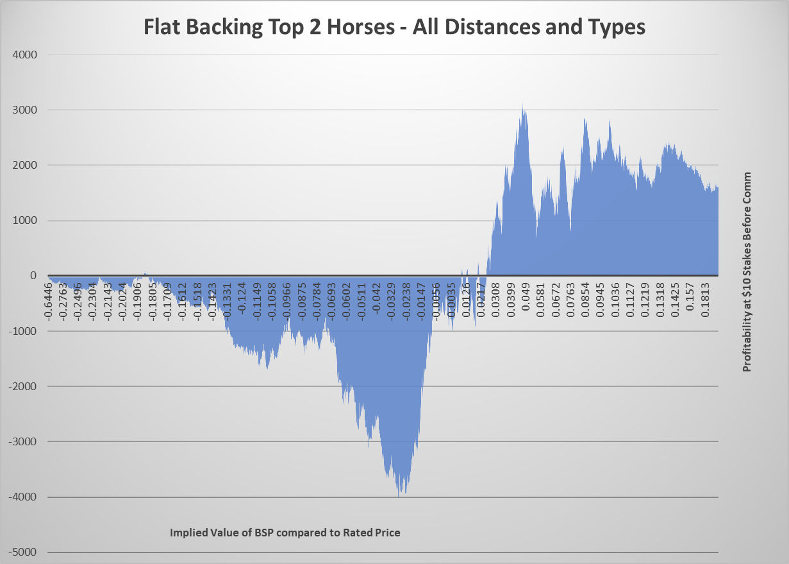

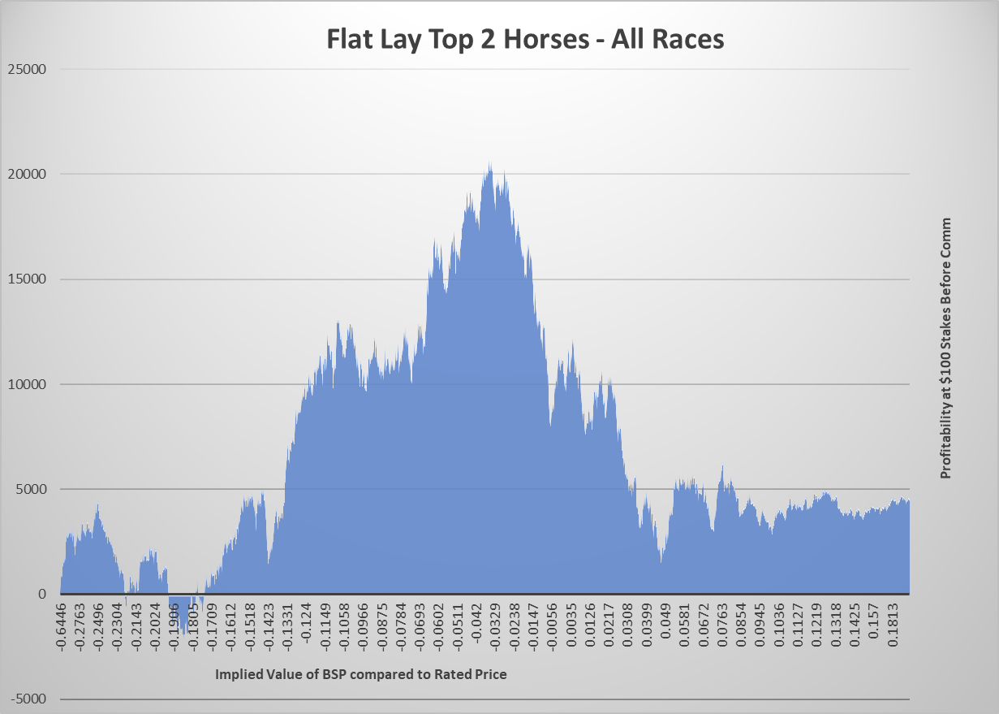

### Distance Buckets

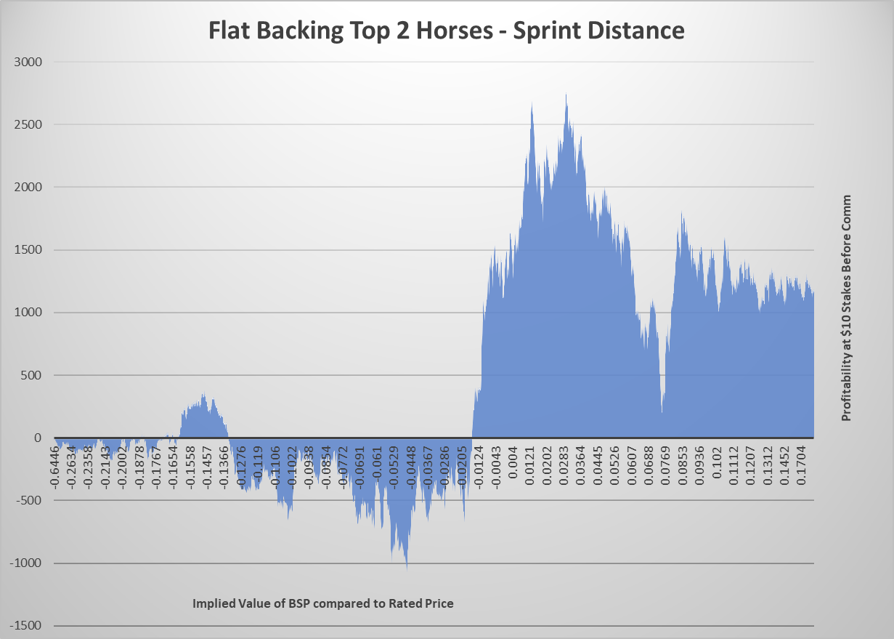

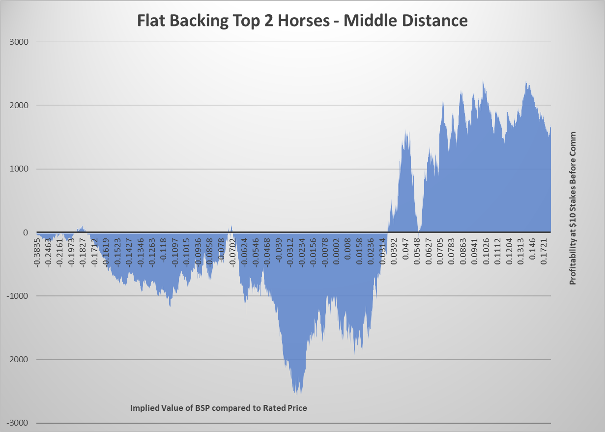

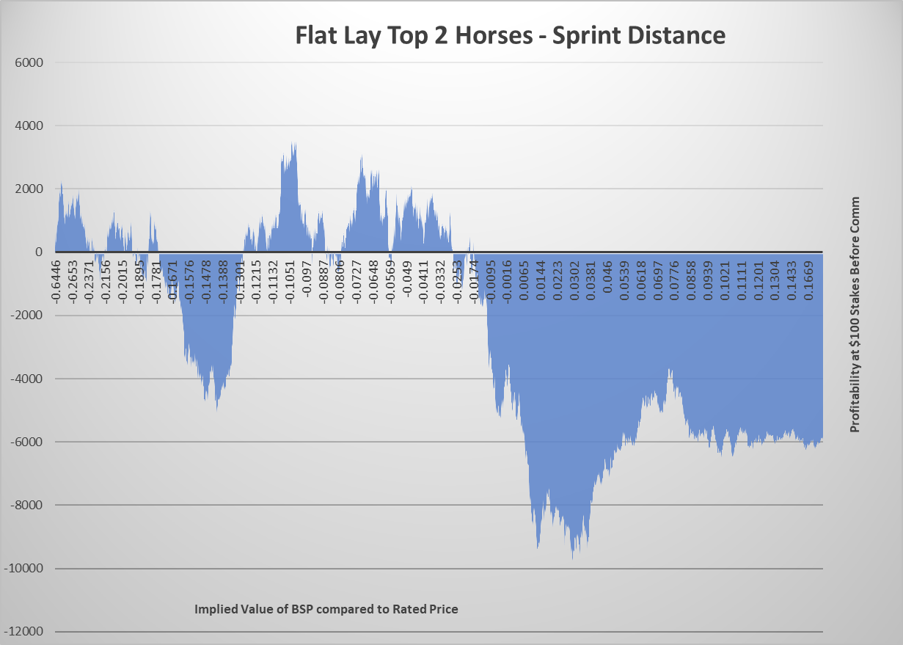

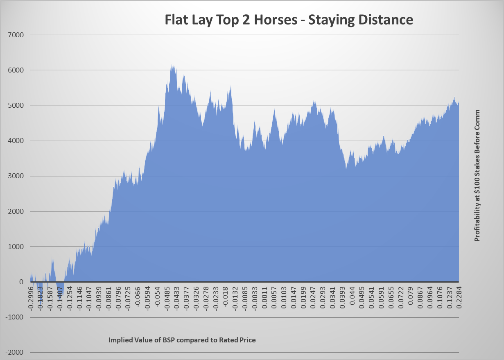

### Race Types

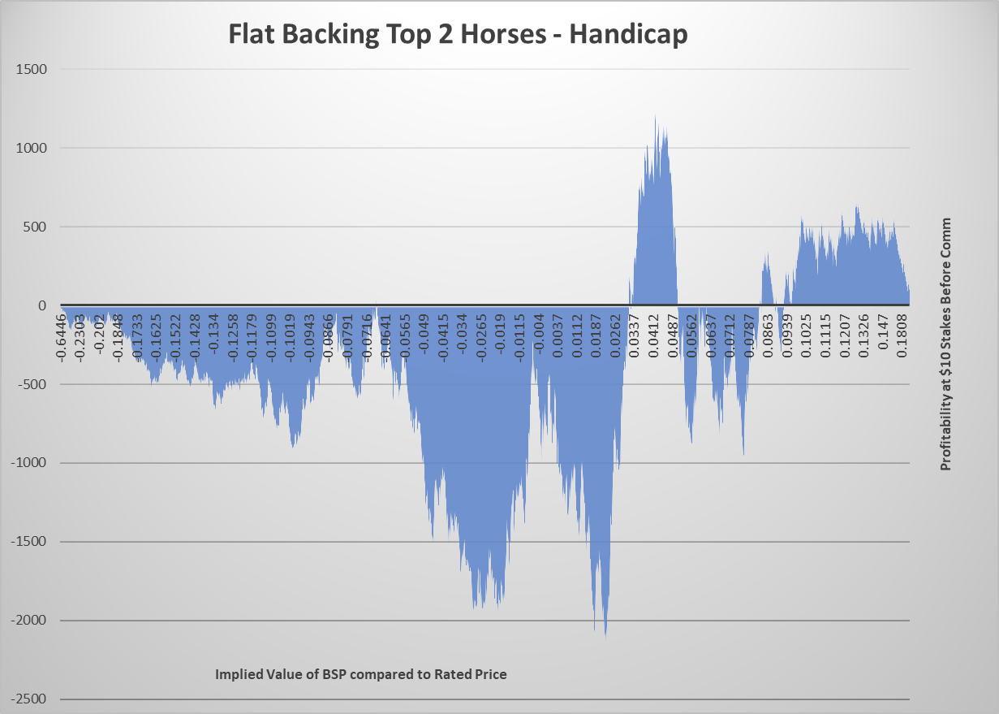

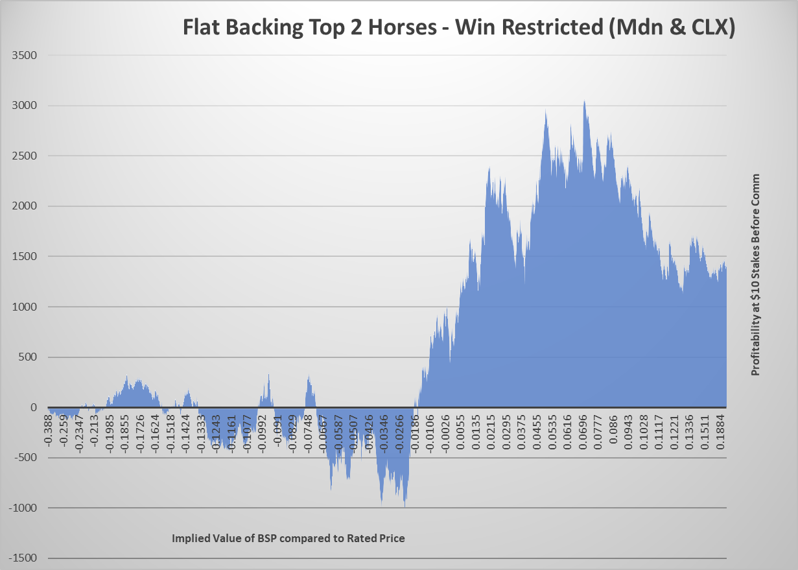

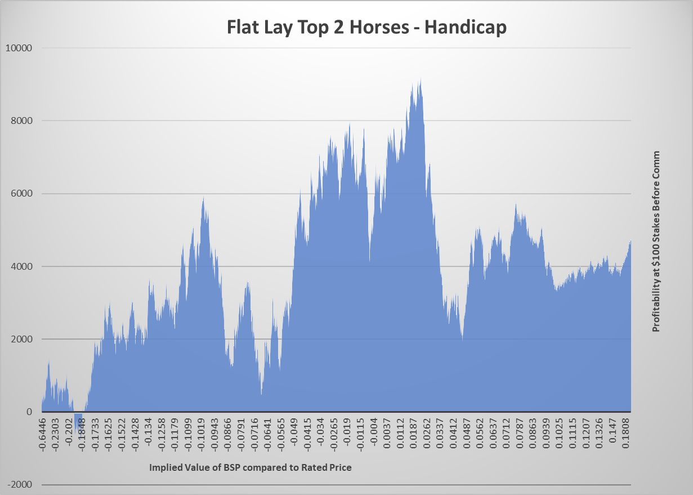

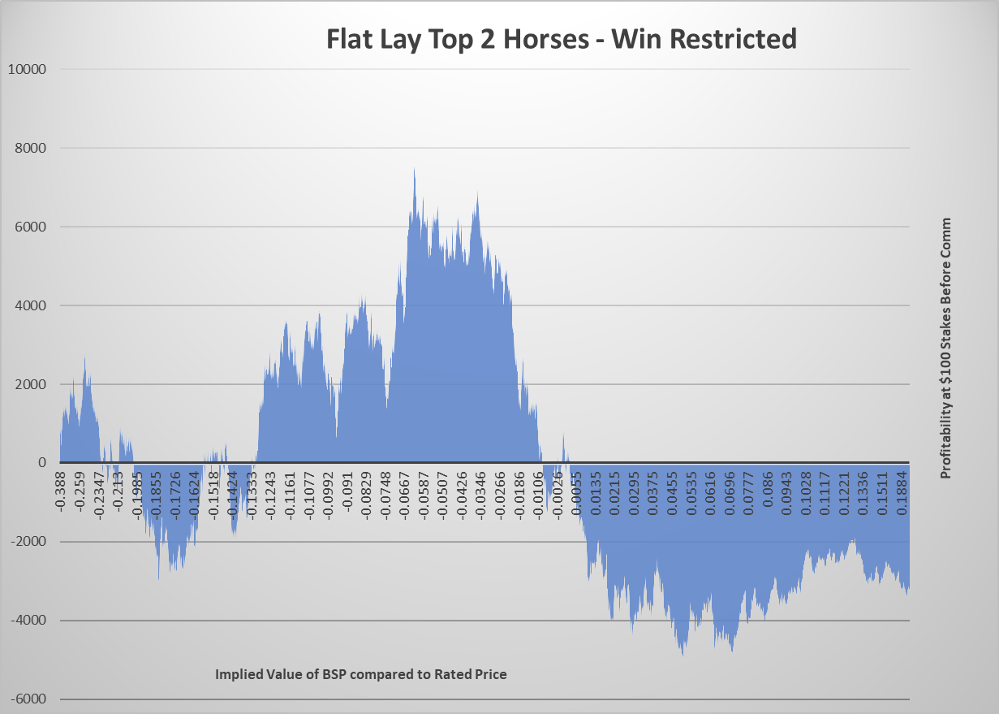

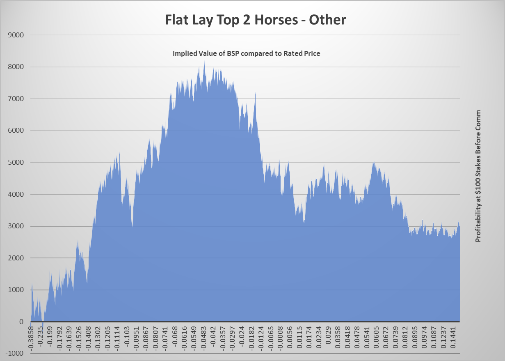

### Field Size

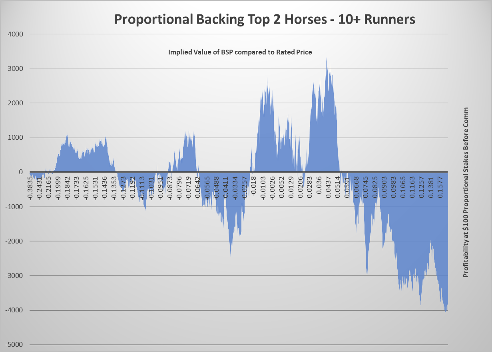

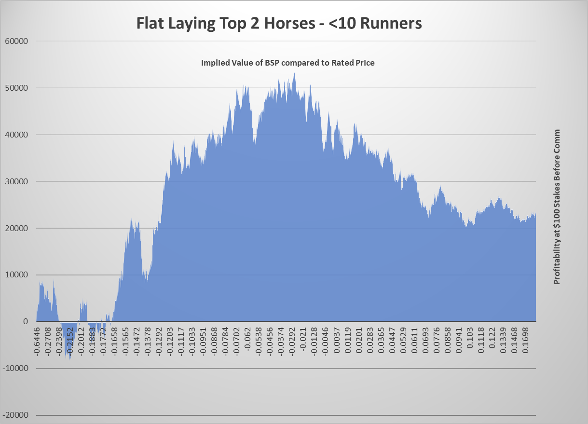

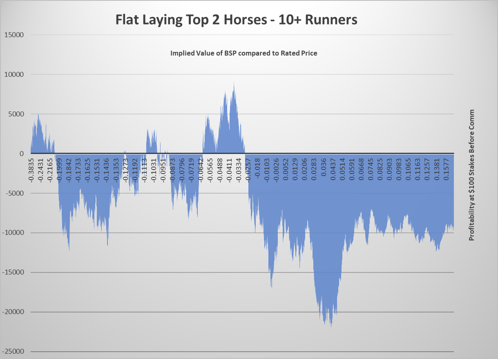

## Practically betting a value range

If you were to bet a value range, say laying the Top 2 Runners in WA races where the value of the best available price is between -7% and 0%, how would you do that?

Well, you would need to first calculate what those boundary prices would be. The upper bound of 0% is easy, that's simply the rated price.
The lower bound of -7% requires a bit of calculation but comes out as:

For example, if a horse at Ascot had a rated price of $3.85 and the upper and lower boundaries for your betting price would be $3.03 and $3.85 (noting that the prices must be converted to valid Betfair ticks).
Now to bet this practically, you can easily place a limit BSP lay bet with the 0% price as your upper bound. However, you cannot specify a minimum lay price, so how can you do that?

Using a third party tool like Bet Angel or a bot directly using the Betfair API, the program can read the available prices and then only bet if the available price is within your range.
We have some more information here on [third party tools](https://betfair-datascientists.github.io/automation/overview/) and using the [API](https://betfair-datascientists.github.io/api/apiResources/) 

## Conclusion

We hope you found this introduction to model staking strategies interesting and informative. If you'd like to know more, please reach out to us at [automation@betfair.com.au](mailto:automation@betfair.com.au)

### Disclaimer 

Note that whilst models and automated strategies are fun and rewarding to create, we can't promise that your model or betting strategy will be profitable, and we make no representations in relation to the code shared or information on this page. If you're using this code or implementing your own strategies, you do so entirely at your own risk and you are responsible for any winnings/losses incurred. Under no circumstances will Betfair be liable for any loss or damage you suffer.